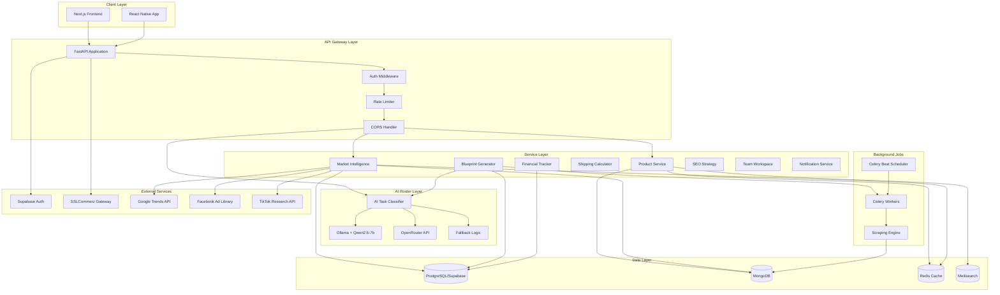
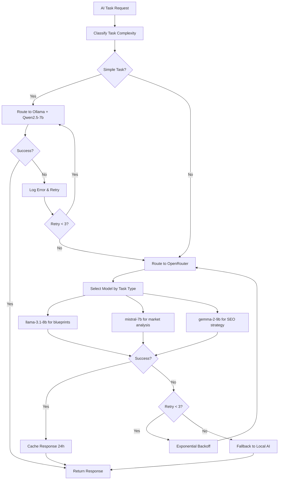
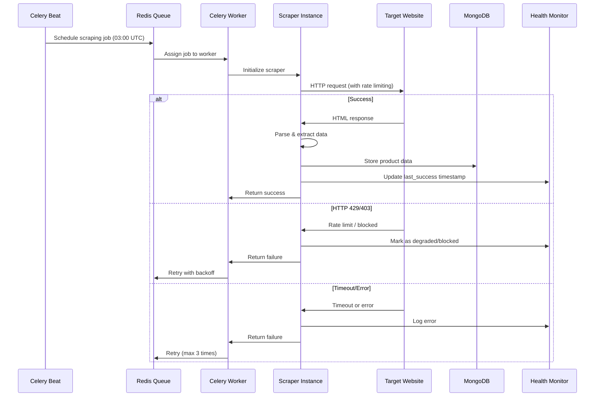
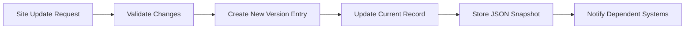

# Design Document: VentureOS Backend

## Overview

VentureOS Backend is a FastAPI-based server application that powers an AI-driven business intelligence and product sourcing platform for Bangladeshi entrepreneurs. The backend orchestrates 12 feature modules covering onboarding, product search, market intelligence, business planning, shipping logistics, financial tracking, SEO strategy, and team collaboration.

### Design Goals

1. **Hybrid AI Architecture**: Intelligent routing between local Ollama models (fast, private, free) and cloud OpenRouter models (high-quality reasoning)
2. **Scalable Data Pipeline**: Automated scraping with Celery workers, efficient storage in PostgreSQL and MongoDB, and Redis caching
3. **Real-Time Intelligence**: Live market trend detection, competitor tracking, and price monitoring with sub-minute latency
4. **Security-First**: AES-256 encryption for financial data, JWT authentication, role-based access control, and compliance with Bangladesh Digital Security Act
5. **Performance-Optimized**: Sub-200ms cached responses, 2-second product searches, connection pooling, and intelligent caching strategies
6. **Bilingual Support**: Native Bengali and English content handling with proper Unicode support and locale-aware formatting
7. **Developer-Friendly**: OpenAPI documentation, comprehensive testing utilities, and containerized deployment

### Technology Choices

- **Framework**: FastAPI with async/await for high-performance concurrent request handling
- **Primary Database**: PostgreSQL via Supabase for structured data (users, subscriptions, financials, blueprints)
- **Document Database**: MongoDB for unstructured scraped product data with flexible schemas
- **Cache Layer**: Redis for API response caching, session storage, and Celery backend
- **Job Queue**: Celery with Redis broker for background tasks and Celery Beat for scheduled jobs
- **Local AI**: Ollama running Qwen2.5-7b for onboarding, translation, tagging, and content generation
- **Cloud AI**: OpenRouter free tier (llama-3.1-8b, mistral-7b, gemma-2-9b) for blueprints and market analysis
- **Scraping**: Playwright for JavaScript-heavy sites, Scrapy for static HTML, with rate limiting and health monitoring
- **Search**: Meilisearch for full-text search across Bengali and English product data
- **PDF Generation**: WeasyPrint for investor-ready blueprint PDFs
- **Authentication**: Supabase Auth with JWT tokens, supporting email, Google OAuth, and phone OTP
- **Payments**: SSLCommerz integration for bKash, Nagad, Rocket, and credit card processing
- **Monitoring**: Prometheus metrics, Sentry error tracking, Uptime Robot availability monitoring


## Architecture

### High-Level System Architecture



### Application Structure

```
ventureos-backend/
├── app/
│   ├── main.py                      # FastAPI application entry point
│   ├── config.py                    # Configuration management
│   ├── dependencies.py              # Dependency injection
│   │
│   ├── api/                         # API routes
│   │   ├── v1/
│   │   │   ├── __init__.py
│   │   │   ├── auth.py             # Authentication endpoints
│   │   │   ├── onboarding.py       # Onboarding flow
│   │   │   ├── products.py         # Product search & details
│   │   │   ├── market.py           # Market intelligence
│   │   │   ├── blueprints.py       # Blueprint generation
│   │   │   ├── shipping.py         # Shipping calculator
│   │   │   ├── financial.py        # Financial tracking
│   │   │   ├── seo.py              # SEO strategy
│   │   │   ├── workspaces.py       # Team collaboration
│   │   │   ├── notifications.py    # Notification management
│   │   │   ├── subscriptions.py    # Subscription & payments
│   │   │   ├── export.py           # Data export
│   │   │   └── users.py            # User profile management
│   │   │
│   │   └── internal/                # Internal/admin endpoints
│   │       ├── scraping.py         # Scraping health monitoring
│   │       └── test.py             # Test utilities (dev only)
│   │
│   ├── core/                        # Core business logic
│   │   ├── ai_router.py            # AI task classification & routing
│   │   ├── local_ai.py             # Ollama integration
│   │   ├── cloud_ai.py             # OpenRouter integration
│   │   ├── auth.py                 # Authentication logic
│   │   ├── rate_limiter.py         # Rate limiting logic
│   │   └── encryption.py           # Data encryption utilities
│   │
│   ├── services/                    # Business services
│   │   ├── product_service.py      # Product search & management
│   │   ├── market_service.py       # Market intelligence
│   │   ├── blueprint_service.py    # Blueprint generation
│   │   ├── shipping_service.py     # Shipping calculations
│   │   ├── financial_service.py    # Financial tracking
│   │   ├── seo_service.py          # SEO strategy generation
│   │   ├── workspace_service.py    # Team workspace management
│   │   ├── notification_service.py # Notification delivery
│   │   ├── subscription_service.py # Subscription management
│   │   └── export_service.py       # Data export
│   │
│   ├── models/                      # Database models
│   │   ├── user.py                 # User model
│   │   ├── subscription.py         # Subscription model
│   │   ├── financial.py            # Financial entry model
│   │   ├── blueprint.py            # Blueprint model
│   │   ├── workspace.py            # Workspace model
│   │   ├── notification.py         # Notification model
│   │   ├── marketplace_site.py     # Module 11 - Marketplace Intelligence
│   │   └── research_site.py        # Module 12 - Research Site Dataset
│   │
│   ├── schemas/                     # Pydantic schemas
│   │   ├── auth.py                 # Auth request/response schemas
│   │   ├── onboarding.py           # Onboarding schemas
│   │   ├── product.py              # Product schemas
│   │   ├── market.py               # Market intelligence schemas
│   │   ├── blueprint.py            # Blueprint schemas
│   │   ├── shipping.py             # Shipping schemas
│   │   ├── financial.py            # Financial schemas
│   │   ├── seo.py                  # SEO schemas
│   │   ├── workspace.py            # Workspace schemas
│   │   ├── notification.py         # Notification schemas
│   │   └── common.py               # Common/shared schemas
│   │
│   ├── tasks/                       # Celery tasks
│   │   ├── scraping.py             # Scraping tasks
│   │   ├── blueprint.py            # Blueprint generation tasks
│   │   ├── notification.py         # Notification delivery tasks
│   │   ├── market.py               # Market data update tasks
│   │   ├── export.py               # Export generation tasks
│   │   └── maintenance.py          # Cleanup & maintenance tasks
│   │
│   ├── scrapers/                    # Web scrapers
│   │   ├── base.py                 # Base scraper class
│   │   ├── alibaba.py              # Alibaba scraper
│   │   ├── pinduoduo.py            # Pinduoduo scraper
│   │   ├── xianyu.py               # Xianyu scraper
│   │   ├── dhgate.py               # DHgate scraper
│   │   ├── aliexpress.py           # AliExpress scraper
│   │   └── health_monitor.py      # Scraping health monitoring
│   │
│   ├── db/                          # Database utilities
│   │   ├── postgres.py             # PostgreSQL connection
│   │   ├── mongodb.py              # MongoDB connection
│   │   ├── redis.py                # Redis connection
│   │   └── migrations/             # Alembic migrations
│   │
│   └── utils/                       # Utility functions
│       ├── translation.py          # Bengali/English translation
│       ├── currency.py             # Currency formatting
│       ├── pdf.py                  # PDF generation
│       ├── validation.py           # Input validation
│       └── logging.py              # Logging configuration
│
├── tests/                           # Test suite
│   ├── unit/                       # Unit tests
│   ├── integration/                # Integration tests
│   ├── e2e/                        # End-to-end tests
│   ├── factories.py                # Test data factories
│   └── conftest.py                 # Pytest configuration
│
├── alembic/                         # Database migrations
├── docker/                          # Docker configurations
├── scripts/                         # Utility scripts
├── requirements.txt                 # Python dependencies
├── docker-compose.yml              # Local development setup
├── Dockerfile                       # Production container
└── README.md                        # Documentation
```


### AI Router Architecture

The AI Router is the intelligence layer that classifies incoming AI tasks and dispatches them to the most appropriate model based on complexity, cost, and quality requirements.

#### Task Classification Logic

```python
class TaskComplexity(Enum):
    SIMPLE = "simple"      # Local AI (Ollama + Qwen2.5-7b)
    COMPLEX = "complex"    # Cloud AI (OpenRouter)

class AITaskClassifier:
    """
    Classifies AI tasks based on:
    - Input length (tokens)
    - Required reasoning depth
    - Quality criticality
    - Response time requirements
    """
    
    SIMPLE_TASKS = {
        "onboarding_qa",           # Onboarding question answering
        "product_translation",     # Chinese to Bengali/English
        "financial_tagging",       # Expense categorization
        "content_generation",      # Social media copy
        "trend_summary",           # Trend description formatting
        "marketplace_query_parse"  # Module 11 query parsing
    }
    
    COMPLEX_TASKS = {
        "blueprint_generation",    # Business plan creation
        "market_analysis",         # Deep market research
        "risk_assessment",         # Risk identification & mitigation
        "seo_strategy",           # SEO keyword & content strategy
        "competitor_analysis",     # Competitor intelligence
        "marketplace_enrichment"   # Module 11 data enrichment
    }
```

#### Model Selection Strategy



#### Fallback Chain

1. **Primary**: Cloud AI (OpenRouter) for complex tasks
2. **Retry**: Up to 3 retries with exponential backoff (1s, 2s, 4s)
3. **Fallback**: Local AI (Ollama) with quality warning
4. **Cache**: Return cached response if available (24h TTL)
5. **Error**: Return graceful error message if all attempts fail

#### Model-Specific Configurations

```python
OPENROUTER_MODELS = {
    "blueprint": {
        "model": "meta-llama/llama-3.1-8b-instruct:free",
        "max_tokens": 4096,
        "temperature": 0.7,
        "timeout": 60
    },
    "market_analysis": {
        "model": "mistralai/mistral-7b-instruct:free",
        "max_tokens": 2048,
        "temperature": 0.5,
        "timeout": 30
    },
    "seo_strategy": {
        "model": "google/gemma-2-9b-it:free",
        "max_tokens": 2048,
        "temperature": 0.6,
        "timeout": 30
    }
}

OLLAMA_CONFIG = {
    "model": "qwen2.5:7b",
    "max_tokens": 1024,
    "temperature": 0.3,
    "timeout": 5
}
```

### Scraping Engine Architecture

The Scraping Engine is a Celery-based distributed system that collects product data from multiple marketplaces while respecting rate limits and monitoring health.

#### Scraping Workflow



#### Scraper Implementation Strategy

**Playwright Scrapers** (JavaScript-heavy sites):
- Alibaba: Full browser automation, handles dynamic loading
- Pinduoduo: Headless Chrome, waits for product grid render
- Xianyu: Browser automation with login handling

**Scrapy Scrapers** (Static HTML sites):
- DHgate: Fast HTML parsing with XPath selectors
- AliExpress: API-first with HTML fallback
- SkyBuyBD: Simple HTML scraping

#### Rate Limiting Strategy

```python
RATE_LIMITS = {
    "alibaba": {
        "requests_per_minute": 10,
        "concurrent_requests": 2,
        "delay_between_requests": 6  # seconds
    },
    "pinduoduo": {
        "requests_per_minute": 5,
        "concurrent_requests": 1,
        "delay_between_requests": 12
    },
    "xianyu": {
        "requests_per_minute": 8,
        "concurrent_requests": 2,
        "delay_between_requests": 7.5
    }
}
```

#### Health Monitoring

```python
class ScraperHealthStatus(Enum):
    HEALTHY = "healthy"        # Last scrape successful < 24h ago
    DEGRADED = "degraded"      # Intermittent failures
    BLOCKED = "blocked"        # HTTP 429/403 for 48+ hours
    UNKNOWN = "unknown"        # Never scraped or no recent data

class HealthMonitor:
    """
    Tracks scraping health per site:
    - Last successful scrape timestamp
    - Error count in last 24 hours
    - HTTP status code patterns
    - Automatic disabling when blocked
    """
```

### Module 11: Marketplace Intelligence Database

Module 11 is a server-side database that stores structured information about marketplace sites, including which sites launch products first in each category. This enables the AI system to efficiently research products.

#### Database Schema

```python
class MarketplaceSite(BaseModel):
    id: UUID
    name: str                          # e.g., "Alibaba 1688"
    url: str                           # Base URL
    platform_type: str                 # "wholesale", "retail", "secondhand"
    product_categories: List[str]      # Categories available on site
    launch_priority_score: float       # 0-100, higher = launches products first
    update_frequency: str              # "high" (6h), "standard" (24h), "low" (weekly)
    scraping_enabled: bool
    last_updated: datetime
    version: int                       # Version number for tracking changes
    created_at: datetime
    updated_at: datetime

class MarketplaceSiteVersion(BaseModel):
    id: UUID
    site_id: UUID
    version: int
    snapshot_data: dict                # Full site record at this version
    changed_fields: List[str]          # Fields that changed
    changed_by: str                    # System or user ID
    change_reason: str
    created_at: datetime
```

#### Version Control System



#### Auto-Update Schedule

- **High-frequency sites** (launch_priority_score > 80): Every 6 hours
- **Standard sites** (score 50-80): Daily at 03:00 UTC
- **Low-frequency sites** (score < 50): Weekly on Sundays

#### Launch Priority Scoring

```python
def calculate_launch_priority_score(site_data: dict) -> float:
    """
    Calculates 0-100 score based on:
    - Historical product launch timing (40%)
    - Site traffic rank (20%)
    - Product catalog size (20%)
    - Update frequency (10%)
    - Data quality (10%)
    """
    score = 0.0
    
    # Historical launch timing: sites that consistently launch products first
    if site_data.get("avg_days_before_competitors", 0) > 30:
        score += 40
    elif site_data.get("avg_days_before_competitors", 0) > 14:
        score += 30
    elif site_data.get("avg_days_before_competitors", 0) > 7:
        score += 20
    
    # Traffic rank (Alexa/SimilarWeb)
    traffic_rank = site_data.get("traffic_rank", 1000000)
    if traffic_rank < 1000:
        score += 20
    elif traffic_rank < 10000:
        score += 15
    elif traffic_rank < 100000:
        score += 10
    
    # Catalog size
    catalog_size = site_data.get("product_count", 0)
    if catalog_size > 1000000:
        score += 20
    elif catalog_size > 100000:
        score += 15
    elif catalog_size > 10000:
        score += 10
    
    # Update frequency
    if site_data.get("daily_new_products", 0) > 1000:
        score += 10
    elif site_data.get("daily_new_products", 0) > 100:
        score += 7
    
    # Data quality
    if site_data.get("data_completeness", 0) > 0.9:
        score += 10
    elif site_data.get("data_completeness", 0) > 0.7:
        score += 7
    
    return min(score, 100.0)
```

### Module 12: Research Site Dataset

Module 12 is a developer-only database that maintains an allowlist of authorized scraping targets with legal risk assessments and access controls.

#### Database Schema

```python
class ResearchSite(BaseModel):
    id: UUID
    name: str
    url: str
    access_method: str                 # "api", "scraping", "manual"
    scraping_enabled: bool
    rate_limit_rpm: int                # Requests per minute
    legal_risk_level: str              # "low", "medium", "high"
    terms_of_service_url: str
    robots_txt_compliant: bool
    requires_authentication: bool
    authentication_method: Optional[str]
    notes: str
    added_by: str                      # Developer ID
    approved_by: str                   # Backend lead ID
    created_at: datetime
    updated_at: datetime

class ResearchSiteAuditLog(BaseModel):
    id: UUID
    site_id: UUID
    action: str                        # "added", "updated", "disabled", "removed"
    before_snapshot: Optional[dict]
    after_snapshot: dict
    changed_by: str
    change_reason: str
    created_at: datetime
```

#### Access Control

- **Read Access**: Backend developers only
- **Write Access**: Backend lead approval required
- **API Exposure**: NOT exposed via public API endpoints
- **Audit Trail**: All changes logged with before/after snapshots

#### Legal Risk Assessment

```python
LEGAL_RISK_CRITERIA = {
    "low": [
        "Has public API with terms allowing commercial use",
        "robots.txt explicitly allows scraping",
        "No authentication required",
        "Terms of service permit data collection"
    ],
    "medium": [
        "No explicit API but scraping not prohibited",
        "robots.txt neutral or partially restrictive",
        "Rate limiting required",
        "Terms of service ambiguous"
    ],
    "high": [
        "Terms of service prohibit scraping",
        "robots.txt disallows all bots",
        "Requires authentication bypass",
        "Previous legal disputes over scraping"
    ]
}
```


## Components and Interfaces

### API Endpoints Specification

#### Authentication Endpoints

**POST /api/v1/auth/signup**
```python
Request:
{
    "email": "user@example.com",
    "password": "SecurePass123!",
    "name": "John Doe",
    "phone": "+8801712345678",
    "locale": "bn"
}

Response (201):
{
    "success": true,
    "data": {
        "user_id": "uuid",
        "email": "user@example.com",
        "access_token": "jwt_token",
        "refresh_token": "refresh_token",
        "expires_in": 86400
    }
}
```

**POST /api/v1/auth/login**
```python
Request:
{
    "email": "user@example.com",
    "password": "SecurePass123!"
}

Response (200):
{
    "success": true,
    "data": {
        "user_id": "uuid",
        "access_token": "jwt_token",
        "refresh_token": "refresh_token",
        "expires_in": 86400
    }
}
```

**POST /api/v1/auth/refresh**
```python
Request:
{
    "refresh_token": "refresh_token"
}

Response (200):
{
    "success": true,
    "data": {
        "access_token": "new_jwt_token",
        "expires_in": 86400
    }
}
```

#### Onboarding Endpoints

**POST /api/v1/onboarding/submit**
```python
Request:
{
    "location": "Dhaka",
    "product_idea": "Wireless earbuds",
    "business_type": "reseller",
    "investment": 50000,
    "team_size": 1,
    "warehouse_capacity": 100,
    "account_type": "domestic",
    "locale": "bn"
}

Response (201):
{
    "success": true,
    "data": {
        "onboarding_id": "uuid",
        "user_mode": "mode_a",
        "recommendations": {
            "suggested_categories": ["electronics", "accessories"],
            "market_opportunity_score": 78
        }
    }
}
```

#### Product Search Endpoints

**GET /api/v1/products/search**
```python
Query Parameters:
- query: string (required)
- platforms: comma-separated list (optional, default: all)
- min_price: float (optional)
- max_price: float (optional)
- quality_tier: "cheap" | "medium" | "high" (optional)
- sort_by: "price" | "rating" | "moq" (optional, default: "relevance")
- page: int (optional, default: 1)
- page_size: int (optional, default: 20, max: 50)

Response (200):
{
    "success": true,
    "data": [
        {
            "id": "uuid",
            "title": "Wireless Bluetooth Earbuds",
            "title_translated": "ওয়্যারলেস ব্লুটুথ ইয়ারবাড",
            "description": "High quality TWS earbuds...",
            "description_translated": "উচ্চ মানের TWS ইয়ারবাড...",
            "images": ["url1", "url2"],
            "platform": "alibaba",
            "price_range": {
                "min": 300,
                "max": 1200,
                "currency": "BDT"
            },
            "quality_tier": "medium",
            "moq": 100,
            "supplier_info": {
                "name": "Shenzhen Electronics Co.",
                "rating": 4.5,
                "years_active": 5,
                "response_rate": 95,
                "reliability_score": 82
            },
            "lead_time": "7-14 days",
            "shipping_options": ["air", "sea"],
            "category": "electronics",
            "tags": ["bluetooth", "wireless", "audio"],
            "last_updated": "2024-01-15T10:30:00Z"
        }
    ],
    "meta": {
        "page": 1,
        "page_size": 20,
        "total": 156,
        "has_more": true
    }
}
```

**GET /api/v1/products/{product_id}**
```python
Response (200):
{
    "success": true,
    "data": {
        "id": "uuid",
        "title": "Wireless Bluetooth Earbuds",
        "title_translated": "ওয়্যারলেস ব্লুটুথ ইয়ারবাড",
        "description": "Detailed product description...",
        "description_translated": "বিস্তারিত পণ্য বিবরণ...",
        "images": ["url1", "url2", "url3"],
        "platform": "alibaba",
        "price_range": {...},
        "quality_tier": "medium",
        "moq": 100,
        "supplier_info": {...},
        "lead_time": "7-14 days",
        "shipping_options": ["air", "sea"],
        "specifications": {
            "battery_life": "6 hours",
            "bluetooth_version": "5.0",
            "charging_case": "Yes"
        },
        "price_history": [
            {"date": "2024-01-01", "price": 350},
            {"date": "2024-01-15", "price": 300}
        ],
        "similar_products": ["uuid1", "uuid2"],
        "category": "electronics",
        "tags": ["bluetooth", "wireless", "audio"],
        "last_updated": "2024-01-15T10:30:00Z"
    }
}
```

#### Market Intelligence Endpoints

**GET /api/v1/market/trends**
```python
Query Parameters:
- category: string (optional)
- geography: string (optional, default: "Bangladesh")
- time_range: "7d" | "30d" | "90d" (optional, default: "30d")
- trajectory: "rising" | "stable" | "declining" (optional)
- page: int (optional, default: 1)
- page_size: int (optional, default: 20)

Response (200):
{
    "success": true,
    "data": [
        {
            "id": "uuid",
            "product_category": "wireless_earbuds",
            "trend_name": "TWS Earbuds Surge",
            "description": "True wireless stereo earbuds seeing 45% growth...",
            "geography": ["Dhaka", "Chattogram", "Sylhet"],
            "data_sources": ["google_trends", "facebook_ads", "tiktok"],
            "metrics": {
                "search_volume": 12500,
                "search_volume_change": 45.2,
                "social_mentions": 8900,
                "ad_spend": 125000
            },
            "timeline": {
                "start_date": "2023-11-01",
                "peak_period": "December 2023 - January 2024",
                "current_trajectory": "rising",
                "estimated_lifespan": "6-9 months"
            },
            "seasonal_flag": {
                "season": "winter",
                "peak_months": ["December", "January"]
            },
            "demand_heatmap": [
                {"region": "Dhaka", "intensity": 85},
                {"region": "Chattogram", "intensity": 72}
            ],
            "competitor_count": 45,
            "market_maturity": "growing",
            "confidence_score": 0.87,
            "created_at": "2024-01-15T08:00:00Z"
        }
    ],
    "meta": {
        "page": 1,
        "page_size": 20,
        "total": 34,
        "has_more": true
    }
}
```

**GET /api/v1/market/competitors**
```python
Query Parameters:
- location: string (required)
- category: string (required)
- radius_km: int (optional, default: 10)

Response (200):
{
    "success": true,
    "data": {
        "competitor_count": 23,
        "competitor_density": "medium",
        "competitors": [
            {
                "name": "Tech Store BD",
                "location": "Dhanmondi, Dhaka",
                "distance_km": 2.5,
                "platforms": ["facebook", "daraz"],
                "product_count": 156,
                "avg_price_range": {"min": 500, "max": 5000},
                "estimated_monthly_sales": 45000
            }
        ],
        "demand_heatmap": [
            {"lat": 23.7465, "lng": 90.3763, "intensity": 78}
        ]
    }
}
```

#### Blueprint Endpoints

**POST /api/v1/blueprints/generate**
```python
Request:
{
    "onboarding_data": {
        "location": "Dhaka",
        "product_idea": "Wireless earbuds",
        "business_type": "reseller",
        "investment": 50000,
        "team_size": 1,
        "warehouse_capacity": 100,
        "account_type": "domestic"
    },
    "locale": "bn"
}

Response (202):
{
    "success": true,
    "data": {
        "job_id": "uuid",
        "status": "queued",
        "estimated_completion": "2024-01-15T10:31:00Z"
    }
}
```

**GET /api/v1/blueprints/{blueprint_id}**
```python
Response (200):
{
    "success": true,
    "data": {
        "id": "uuid",
        "user_id": "uuid",
        "product_idea": "Wireless earbuds",
        "business_type": "reseller",
        "business_model_canvas": {
            "value_proposition": "Affordable high-quality wireless earbuds...",
            "customer_segments": ["Young professionals", "Students"],
            "channels": ["Facebook Marketplace", "Daraz"],
            "customer_relationships": ["Social media engagement"],
            "revenue_streams": [
                {"name": "Product sales", "type": "direct", "projected_monthly": 75000}
            ],
            "key_resources": ["Supplier relationships", "Social media presence"],
            "key_activities": ["Product sourcing", "Marketing", "Customer service"],
            "key_partnerships": ["Chinese suppliers", "Shipping agencies"],
            "cost_structure": [
                {"category": "Inventory", "amount": 30000, "frequency": "monthly"},
                {"category": "Marketing", "amount": 5000, "frequency": "monthly"}
            ]
        },
        "financial_projections": {
            "scenarios": {
                "conservative": [
                    {"month": 1, "revenue": 45000, "costs": 38000, "profit": 7000, "cash_flow": 7000}
                ],
                "base": [
                    {"month": 1, "revenue": 75000, "costs": 52000, "profit": 23000, "cash_flow": 23000}
                ],
                "optimistic": [
                    {"month": 1, "revenue": 120000, "costs": 68000, "profit": 52000, "cash_flow": 52000}
                ]
            },
            "assumptions": [
                "Average selling price: ৳1,500 per unit",
                "Cost per unit: ৳800 (including shipping)"
            ],
            "investment_breakdown": [
                {"category": "Initial inventory", "amount": 30000, "percentage": 60},
                {"category": "Marketing", "amount": 10000, "percentage": 20}
            ]
        },
        "break_even_analysis": {
            "fixed_costs": 15000,
            "variable_cost_per_unit": 800,
            "price_per_unit": 1500,
            "break_even_units": 22,
            "break_even_revenue": 33000,
            "months_to_break_even": 1
        },
        "market_sizing": {
            "tam": 5000000000,
            "sam": 500000000,
            "som": 5000000,
            "methodology": "Bottom-up analysis based on Bangladesh population..."
        },
        "go_to_market_plan": {
            "phases": [
                {
                    "phase": 1,
                    "name": "Soft Launch",
                    "duration": "Month 1",
                    "activities": ["Set up Facebook page", "Initial inventory order"],
                    "budget": 15000
                }
            ],
            "channel_prioritization": [
                {
                    "name": "Facebook Marketplace",
                    "priority": 1,
                    "rationale": "Largest audience, low barrier to entry",
                    "estimated_cac": 50
                }
            ],
            "launch_timeline": "3 months to full operation"
        },
        "seo_strategy": {
            "google_seo": {
                "keywords": [
                    {"term": "ওয়্যারলেস ইয়ারবাড", "search_volume": 8900, "competition": "medium", "language": "bn"}
                ],
                "content_topics": ["Best wireless earbuds under 2000 taka"]
            },
            "social_seo": {
                "platforms": [
                    {
                        "name": "TikTok",
                        "strategy": "Product unboxing videos",
                        "posting_frequency": "3x per week"
                    }
                ],
                "hashtags": [
                    {"tag": "#WirelessEarbuds", "volume": 45000, "trend_duration": "6 months"}
                ]
            },
            "marketplace_seo": [
                {
                    "platform": "Daraz",
                    "title_template": "[Brand] Wireless Bluetooth Earbuds - [Key Feature]",
                    "description_template": "High quality wireless earbuds with..."
                }
            ],
            "google_lens_optimization": {
                "image_tagging": ["product", "earbuds", "wireless"],
                "alt_text_guidance": "Include brand, product type, and key feature"
            }
        },
        "risk_register": [
            {
                "category": "Supply Chain",
                "description": "Supplier delays or quality issues",
                "likelihood": "medium",
                "impact": "high",
                "mitigation": "Maintain relationships with 2-3 backup suppliers"
            }
        ],
        "team_structure": {
            "roles": [
                {
                    "title": "Operations Manager",
                    "responsibilities": ["Inventory management", "Supplier coordination"],
                    "required_skills": ["Logistics", "Negotiation"],
                    "estimated_salary": 25000
                }
            ],
            "hiring_priority": ["Social media manager", "Customer service rep"]
        },
        "confidence_scores": {
            "overall": 0.82,
            "financial": 0.85,
            "market": 0.78,
            "execution": 0.83
        },
        "generated_at": "2024-01-15T10:30:45Z",
        "version": 1
    }
}
```

**GET /api/v1/blueprints/{blueprint_id}/pdf**
```python
Response (200):
Content-Type: application/pdf
Content-Disposition: attachment; filename="blueprint_wireless_earbuds.pdf"

[PDF binary data]
```

#### Shipping Endpoints

**POST /api/v1/shipping/calculate**
```python
Request:
{
    "weight_kg": 5.5,
    "dimensions": {
        "length_cm": 40,
        "width_cm": 30,
        "height_cm": 20
    },
    "origin": "Guangzhou, China",
    "destination": "Dhaka, Bangladesh",
    "product_category": "electronics"
}

Response (200):
{
    "success": true,
    "data": [
        {
            "agency": "SKS Group",
            "method": "air",
            "cost": 2200,
            "currency": "BDT",
            "lead_time": {"min": 7, "max": 10, "unit": "days"},
            "customs_duty": {
                "amount": 1500,
                "rate": 0.25,
                "hs_code": "8518.30"
            },
            "additional_fees": [
                {"name": "Handling fee", "amount": 500},
                {"name": "Documentation", "amount": 300}
            ],
            "total_landed_cost": 4500,
            "risk_flags": [],
            "seasonal_warnings": [],
            "insurance_recommended": false,
            "calculated_at": "2024-01-15T10:30:00Z"
        },
        {
            "agency": "SkyBuyBD",
            "method": "air",
            "cost": 2000,
            "currency": "BDT",
            "lead_time": {"min": 10, "max": 14, "unit": "days"},
            "customs_duty": {"amount": 1500, "rate": 0.25, "hs_code": "8518.30"},
            "additional_fees": [{"name": "Service fee", "amount": 400}],
            "total_landed_cost": 3900,
            "risk_flags": [],
            "seasonal_warnings": [
                {
                    "period": "Chinese New Year (Feb 10-17)",
                    "impact": "Possible 5-7 day delay"
                }
            ],
            "insurance_recommended": false,
            "calculated_at": "2024-01-15T10:30:00Z"
        }
    ]
}
```

#### Financial Tracking Endpoints

**POST /api/v1/financial/entries**
```python
Request:
{
    "type": "revenue",
    "amount": 15000,
    "currency": "BDT",
    "category": "product_sales",
    "subcategory": "wireless_earbuds",
    "description": "Sold 10 units on Facebook Marketplace",
    "date": "2024-01-15",
    "product_id": "uuid",
    "invoice_number": "INV-001",
    "payment_method": "bkash"
}

Response (201):
{
    "success": true,
    "data": {
        "id": "uuid",
        "type": "revenue",
        "amount": 15000,
        "currency": "BDT",
        "category": "product_sales",
        "description": "Sold 10 units on Facebook Marketplace",
        "date": "2024-01-15",
        "created_at": "2024-01-15T10:30:00Z",
        "sync_status": "synced"
    }
}
```

**GET /api/v1/financial/entries**
```python
Query Parameters:
- type: "revenue" | "expense" (optional)
- start_date: date (optional)
- end_date: date (optional)
- category: string (optional)
- page: int (optional, default: 1)
- page_size: int (optional, default: 20)

Response (200):
{
    "success": true,
    "data": [
        {
            "id": "uuid",
            "type": "revenue",
            "amount": 15000,
            "currency": "BDT",
            "category": "product_sales",
            "description": "Sold 10 units...",
            "date": "2024-01-15",
            "created_at": "2024-01-15T10:30:00Z"
        }
    ],
    "meta": {
        "page": 1,
        "page_size": 20,
        "total": 45,
        "has_more": true
    }
}
```

**GET /api/v1/financial/analytics**
```python
Query Parameters:
- start_date: date (required)
- end_date: date (required)
- group_by: "day" | "week" | "month" (optional, default: "month")

Response (200):
{
    "success": true,
    "data": {
        "total_revenue": 450000,
        "total_expenses": 320000,
        "net_profit": 130000,
        "profit_margin": 0.289,
        "best_sellers": [
            {
                "product_id": "uuid",
                "product_name": "Wireless Earbuds",
                "units_sold": 150,
                "revenue": 225000,
                "profit": 105000
            }
        ],
        "unsold_stock": [
            {
                "product_id": "uuid",
                "product_name": "Smart Watch",
                "days_unsold": 45,
                "units": 20,
                "value": 40000
            }
        ],
        "break_even_progress": {
            "target_revenue": 500000,
            "current_revenue": 450000,
            "percentage": 0.90
        },
        "time_series": [
            {
                "period": "2024-01",
                "revenue": 450000,
                "expenses": 320000,
                "profit": 130000
            }
        ]
    }
}
```


#### SEO Strategy Endpoints

**POST /api/v1/seo/strategy**
```python
Request:
{
    "product_category": "wireless_earbuds",
    "target_audience": "young_professionals",
    "location": "Bangladesh",
    "locale": "bn"
}

Response (200):
{
    "success": true,
    "data": {
        "google_seo": {
            "keywords": [
                {
                    "term": "ওয়্যারলেস ইয়ারবাড",
                    "search_volume": 8900,
                    "competition": "medium",
                    "language": "bn"
                },
                {
                    "term": "wireless earbuds bangladesh",
                    "search_volume": 5600,
                    "competition": "low",
                    "language": "en"
                }
            ],
            "content_topics": [
                "Best wireless earbuds under 2000 taka in Bangladesh",
                "How to choose wireless earbuds - Bengali guide"
            ]
        },
        "social_seo": {
            "platforms": [
                {
                    "name": "Facebook",
                    "strategy": "Product showcase posts with customer testimonials",
                    "posting_frequency": "Daily",
                    "best_times": ["9:00 PM", "1:00 PM", "8:00 PM"]
                },
                {
                    "name": "TikTok",
                    "strategy": "15-second product unboxing and feature demos",
                    "posting_frequency": "3x per week",
                    "best_times": ["8:00 PM", "10:00 PM"]
                }
            ],
            "hashtags": [
                {"tag": "#WirelessEarbudsBD", "volume": 12000, "trend_duration": "6 months"},
                {"tag": "#TechBangladesh", "volume": 45000, "trend_duration": "ongoing"}
            ]
        },
        "marketplace_seo": [
            {
                "platform": "Daraz",
                "title_template": "[Brand] Wireless Bluetooth Earbuds TWS - [Key Feature] - [Color]",
                "description_template": "✅ High Quality Wireless Earbuds\n✅ [Battery Life]\n✅ [Bluetooth Version]\n✅ Fast Delivery in Dhaka\n\nবিস্তারিত বিবরণ:\n[Bengali description]"
            }
        ],
        "ad_copy": {
            "facebook_ad": {
                "headline_bn": "সেরা ওয়্যারলেস ইয়ারবাড মাত্র ৳১,৫০০",
                "headline_en": "Best Wireless Earbuds Only ৳1,500",
                "body_bn": "উচ্চ মানের সাউন্ড, দীর্ঘস্থায়ী ব্যাটারি। আজই অর্ডার করুন!",
                "body_en": "High quality sound, long-lasting battery. Order today!",
                "cta": "Shop Now"
            },
            "tiktok_script": {
                "hook": "Wait, these earbuds are only ৳1,500? 😱",
                "middle": "Show unboxing, sound test, battery life demo",
                "cta": "Link in bio to order! Limited stock 🔥"
            }
        },
        "suggested_price": 1500,
        "related_products": [
            {"name": "Phone cases", "reason": "Complementary accessory"},
            {"name": "Charging cables", "reason": "Upsell opportunity"}
        ]
    }
}
```

#### Workspace Endpoints

**POST /api/v1/workspaces**
```python
Request:
{
    "name": "My Business Team",
    "settings": {
        "allow_guest_access": false,
        "data_retention_days": 365
    }
}

Response (201):
{
    "success": true,
    "data": {
        "id": "uuid",
        "name": "My Business Team",
        "owner_id": "uuid",
        "members": [
            {
                "user_id": "uuid",
                "role": "owner",
                "permissions": {
                    "view_financials": true,
                    "edit_financials": true,
                    "view_blueprints": true,
                    "edit_blueprints": true,
                    "manage_team": true,
                    "export_data": true
                },
                "joined_at": "2024-01-15T10:30:00Z"
            }
        ],
        "created_at": "2024-01-15T10:30:00Z"
    }
}
```

**POST /api/v1/workspaces/{workspace_id}/members**
```python
Request:
{
    "email": "member@example.com",
    "role": "analyst",
    "permissions": {
        "view_financials": true,
        "edit_financials": false,
        "view_blueprints": true,
        "edit_blueprints": false,
        "manage_team": false,
        "export_data": false
    }
}

Response (201):
{
    "success": true,
    "data": {
        "user_id": "uuid",
        "role": "analyst",
        "permissions": {...},
        "joined_at": "2024-01-15T10:30:00Z"
    }
}
```

#### Notification Endpoints

**GET /api/v1/notifications**
```python
Query Parameters:
- type: "price_drop" | "trend_alert" | "reorder" | "team_activity" | "system" (optional)
- read: boolean (optional)
- page: int (optional, default: 1)
- page_size: int (optional, default: 20)

Response (200):
{
    "success": true,
    "data": [
        {
            "id": "uuid",
            "type": "price_drop",
            "title": "Price Drop Alert",
            "message": "Wireless earbuds price dropped from ৳1,200 to ৳900",
            "data": {
                "product_id": "uuid",
                "old_price": 1200,
                "new_price": 900,
                "percentage_drop": 25
            },
            "priority": "medium",
            "read": false,
            "action_url": "/products/uuid",
            "action_label": "View Product",
            "created_at": "2024-01-15T10:30:00Z"
        }
    ],
    "meta": {
        "page": 1,
        "page_size": 20,
        "total": 12,
        "unread_count": 5
    }
}
```

**PATCH /api/v1/notifications/{notification_id}/read**
```python
Response (200):
{
    "success": true,
    "data": {
        "id": "uuid",
        "read": true,
        "updated_at": "2024-01-15T10:30:00Z"
    }
}
```

#### Subscription Endpoints

**GET /api/v1/subscriptions/current**
```python
Response (200):
{
    "success": true,
    "data": {
        "tier": "pro",
        "status": "active",
        "current_period_start": "2024-01-01T00:00:00Z",
        "current_period_end": "2024-02-01T00:00:00Z",
        "usage_quota": {
            "blueprints_generated": 3,
            "blueprints_limit": 10,
            "api_calls_used": 1250,
            "api_calls_limit": 10000
        },
        "next_billing_date": "2024-02-01T00:00:00Z",
        "amount": 999,
        "currency": "BDT"
    }
}
```

**POST /api/v1/subscriptions/upgrade**
```python
Request:
{
    "tier": "pro",
    "payment_method": "bkash"
}

Response (200):
{
    "success": true,
    "data": {
        "payment_session_id": "uuid",
        "redirect_url": "https://sslcommerz.com/payment/...",
        "amount": 999,
        "currency": "BDT"
    }
}
```

**POST /api/v1/subscriptions/cancel**
```python
Response (200):
{
    "success": true,
    "data": {
        "status": "cancelled",
        "cancellation_date": "2024-01-15T10:30:00Z",
        "access_until": "2024-02-01T00:00:00Z"
    }
}
```

#### Export Endpoints

**GET /api/v1/export/financial**
```python
Query Parameters:
- start_date: date (required)
- end_date: date (required)
- format: "csv" | "json" (optional, default: "csv")

Response (200):
Content-Type: text/csv
Content-Disposition: attachment; filename="financial_data_2024-01.csv"

[CSV data]
```

**GET /api/v1/export/blueprint/{blueprint_id}**
```python
Query Parameters:
- format: "pdf" | "json" (optional, default: "pdf")

Response (200):
Content-Type: application/pdf
Content-Disposition: attachment; filename="blueprint_wireless_earbuds.pdf"

[PDF binary data]
```

#### User Management Endpoints

**GET /api/v1/users/profile**
```python
Response (200):
{
    "success": true,
    "data": {
        "id": "uuid",
        "email": "user@example.com",
        "name": "John Doe",
        "phone": "+8801712345678",
        "business_info": {
            "name": "Tech Reseller BD",
            "type": "reseller",
            "location": "Dhaka",
            "team_size": 1,
            "warehouse_capacity": 100
        },
        "preferences": {
            "locale": "bn",
            "currency": "BDT",
            "notifications": {
                "email": true,
                "push": true,
                "sms": false
            }
        },
        "subscription": {...},
        "onboarding_completed": true,
        "user_mode": "mode_a",
        "created_at": "2024-01-01T00:00:00Z"
    }
}
```

**PATCH /api/v1/users/profile**
```python
Request:
{
    "name": "John Doe Updated",
    "business_info": {
        "team_size": 2
    },
    "preferences": {
        "locale": "en"
    }
}

Response (200):
{
    "success": true,
    "data": {
        "id": "uuid",
        "name": "John Doe Updated",
        "business_info": {
            "team_size": 2
        },
        "preferences": {
            "locale": "en"
        },
        "updated_at": "2024-01-15T10:30:00Z"
    }
}
```

**GET /api/v1/users/export**
```python
Response (200):
{
    "success": true,
    "data": {
        "user": {...},
        "onboarding_data": {...},
        "financial_entries": [...],
        "blueprints": [...],
        "workspaces": [...],
        "notifications": [...],
        "export_timestamp": "2024-01-15T10:30:00Z"
    }
}
```

**DELETE /api/v1/users/delete**
```python
Request:
{
    "confirmation": "DELETE_MY_ACCOUNT",
    "password": "user_password"
}

Response (200):
{
    "success": true,
    "data": {
        "message": "Account deletion scheduled. All data will be permanently deleted within 30 days.",
        "deletion_date": "2024-02-14T10:30:00Z"
    }
}
```

#### Internal/Admin Endpoints

**GET /api/internal/scraping/health**
```python
Response (200):
{
    "success": true,
    "data": [
        {
            "site": "alibaba",
            "status": "healthy",
            "last_success": "2024-01-15T03:15:00Z",
            "error_count_24h": 0,
            "avg_response_time_ms": 1250
        },
        {
            "site": "pinduoduo",
            "status": "degraded",
            "last_success": "2024-01-15T03:10:00Z",
            "error_count_24h": 5,
            "avg_response_time_ms": 3500,
            "recent_errors": [
                {"timestamp": "2024-01-15T03:05:00Z", "error": "Timeout"}
            ]
        }
    ]
}
```

### Middleware Components

#### Authentication Middleware

```python
class AuthMiddleware:
    """
    Validates JWT tokens and attaches user context to requests.
    
    Flow:
    1. Extract token from Authorization header
    2. Validate token signature and expiration
    3. Query user from database
    4. Attach user object to request context
    5. Reject with 401 if invalid
    """
    
    async def __call__(self, request: Request, call_next):
        # Skip auth for public endpoints
        if request.url.path in PUBLIC_ENDPOINTS:
            return await call_next(request)
        
        # Extract and validate token
        token = self.extract_token(request)
        if not token:
            return JSONResponse(
                status_code=401,
                content={"success": false, "error": {"code": "UNAUTHORIZED", "message": "Missing authentication token"}}
            )
        
        try:
            payload = jwt.decode(token, SECRET_KEY, algorithms=["HS256"])
            user = await get_user_by_id(payload["user_id"])
            request.state.user = user
            return await call_next(request)
        except jwt.ExpiredSignatureError:
            return JSONResponse(
                status_code=401,
                content={"success": false, "error": {"code": "TOKEN_EXPIRED", "message": "Authentication token has expired"}}
            )
        except Exception as e:
            return JSONResponse(
                status_code=401,
                content={"success": false, "error": {"code": "INVALID_TOKEN", "message": "Invalid authentication token"}}
            )
```

#### Rate Limiting Middleware

```python
class RateLimitMiddleware:
    """
    Enforces rate limits based on subscription tier.
    
    Limits:
    - Free tier: 20 product searches/day, 1 blueprint/month
    - Pro tier: Unlimited searches, 10 blueprints/month
    - Enterprise tier: Unlimited everything
    """
    
    RATE_LIMITS = {
        "free": {
            "product_search": {"limit": 20, "window": "day"},
            "blueprint_generate": {"limit": 1, "window": "month"}
        },
        "pro": {
            "product_search": {"limit": None, "window": None},
            "blueprint_generate": {"limit": 10, "window": "month"}
        },
        "enterprise": {
            "product_search": {"limit": None, "window": None},
            "blueprint_generate": {"limit": None, "window": None}
        }
    }
    
    async def __call__(self, request: Request, call_next):
        user = request.state.user
        endpoint = self.get_endpoint_key(request.url.path)
        
        if not endpoint:
            return await call_next(request)
        
        # Check rate limit
        usage = await self.get_usage(user.id, endpoint)
        limit = self.RATE_LIMITS[user.subscription.tier][endpoint]
        
        if limit["limit"] and usage >= limit["limit"]:
            return JSONResponse(
                status_code=429,
                content={
                    "success": false,
                    "error": {
                        "code": "RATE_LIMIT_EXCEEDED",
                        "message": f"Rate limit exceeded. Upgrade to Pro for unlimited access.",
                        "details": {
                            "limit": limit["limit"],
                            "window": limit["window"],
                            "usage": usage,
                            "reset_at": self.get_reset_time(limit["window"])
                        }
                    }
                }
            )
        
        # Increment usage counter
        await self.increment_usage(user.id, endpoint)
        
        # Add rate limit headers
        response = await call_next(request)
        if limit["limit"]:
            response.headers["X-RateLimit-Limit"] = str(limit["limit"])
            response.headers["X-RateLimit-Remaining"] = str(limit["limit"] - usage - 1)
            response.headers["X-RateLimit-Reset"] = self.get_reset_time(limit["window"])
        
        return response
```

#### CORS Middleware

```python
CORS_CONFIG = {
    "allow_origins": [
        "https://ventureos.app",
        "https://www.ventureos.app",
        "http://localhost:3000"  # Development only
    ],
    "allow_methods": ["GET", "POST", "PUT", "PATCH", "DELETE", "OPTIONS"],
    "allow_headers": ["Authorization", "Content-Type", "X-Request-ID"],
    "allow_credentials": True,
    "max_age": 3600
}
```


## Data Models

### PostgreSQL Database Schema

#### Users Table

```sql
CREATE TABLE users (
    id UUID PRIMARY KEY DEFAULT gen_random_uuid(),
    email VARCHAR(255) UNIQUE NOT NULL,
    password_hash VARCHAR(255),  -- NULL for OAuth users
    name VARCHAR(255) NOT NULL,
    phone VARCHAR(20),
    email_verified BOOLEAN DEFAULT FALSE,
    phone_verified BOOLEAN DEFAULT FALSE,
    created_at TIMESTAMP WITH TIME ZONE DEFAULT NOW(),
    updated_at TIMESTAMP WITH TIME ZONE DEFAULT NOW(),
    deleted_at TIMESTAMP WITH TIME ZONE  -- Soft delete
);

CREATE INDEX idx_users_email ON users(email);
CREATE INDEX idx_users_phone ON users(phone);
```

#### Business Info Table

```sql
CREATE TABLE business_info (
    id UUID PRIMARY KEY DEFAULT gen_random_uuid(),
    user_id UUID NOT NULL REFERENCES users(id) ON DELETE CASCADE,
    business_name VARCHAR(255),
    business_type VARCHAR(50) NOT NULL,  -- reseller, importer, sme, manufacturer
    location VARCHAR(255) NOT NULL,
    team_size INTEGER DEFAULT 1,
    warehouse_capacity INTEGER,
    account_type VARCHAR(20) NOT NULL,  -- domestic, international
    target_countries TEXT[],  -- For international accounts
    currencies TEXT[],  -- For international accounts
    created_at TIMESTAMP WITH TIME ZONE DEFAULT NOW(),
    updated_at TIMESTAMP WITH TIME ZONE DEFAULT NOW()
);

CREATE INDEX idx_business_info_user_id ON business_info(user_id);
```

#### User Preferences Table

```sql
CREATE TABLE user_preferences (
    id UUID PRIMARY KEY DEFAULT gen_random_uuid(),
    user_id UUID NOT NULL REFERENCES users(id) ON DELETE CASCADE,
    locale VARCHAR(5) DEFAULT 'bn',  -- bn or en
    currency VARCHAR(3) DEFAULT 'BDT',
    email_notifications BOOLEAN DEFAULT TRUE,
    push_notifications BOOLEAN DEFAULT TRUE,
    sms_notifications BOOLEAN DEFAULT FALSE,
    created_at TIMESTAMP WITH TIME ZONE DEFAULT NOW(),
    updated_at TIMESTAMP WITH TIME ZONE DEFAULT NOW()
);

CREATE INDEX idx_user_preferences_user_id ON user_preferences(user_id);
```

#### Subscriptions Table

```sql
CREATE TABLE subscriptions (
    id UUID PRIMARY KEY DEFAULT gen_random_uuid(),
    user_id UUID NOT NULL REFERENCES users(id) ON DELETE CASCADE,
    tier VARCHAR(20) NOT NULL,  -- free, pro, enterprise
    status VARCHAR(20) NOT NULL,  -- active, cancelled, expired
    current_period_start TIMESTAMP WITH TIME ZONE NOT NULL,
    current_period_end TIMESTAMP WITH TIME ZONE NOT NULL,
    cancel_at_period_end BOOLEAN DEFAULT FALSE,
    cancelled_at TIMESTAMP WITH TIME ZONE,
    created_at TIMESTAMP WITH TIME ZONE DEFAULT NOW(),
    updated_at TIMESTAMP WITH TIME ZONE DEFAULT NOW()
);

CREATE INDEX idx_subscriptions_user_id ON subscriptions(user_id);
CREATE INDEX idx_subscriptions_status ON subscriptions(status);
```

#### Usage Quota Table

```sql
CREATE TABLE usage_quota (
    id UUID PRIMARY KEY DEFAULT gen_random_uuid(),
    user_id UUID NOT NULL REFERENCES users(id) ON DELETE CASCADE,
    period_start TIMESTAMP WITH TIME ZONE NOT NULL,
    period_end TIMESTAMP WITH TIME ZONE NOT NULL,
    blueprints_generated INTEGER DEFAULT 0,
    blueprints_limit INTEGER NOT NULL,
    api_calls_used INTEGER DEFAULT 0,
    api_calls_limit INTEGER NOT NULL,
    created_at TIMESTAMP WITH TIME ZONE DEFAULT NOW(),
    updated_at TIMESTAMP WITH TIME ZONE DEFAULT NOW()
);

CREATE INDEX idx_usage_quota_user_id ON usage_quota(user_id);
CREATE INDEX idx_usage_quota_period ON usage_quota(period_start, period_end);
```

#### Payment Transactions Table

```sql
CREATE TABLE payment_transactions (
    id UUID PRIMARY KEY DEFAULT gen_random_uuid(),
    user_id UUID NOT NULL REFERENCES users(id) ON DELETE CASCADE,
    subscription_id UUID REFERENCES subscriptions(id),
    amount DECIMAL(10, 2) NOT NULL,
    currency VARCHAR(3) NOT NULL,
    payment_method VARCHAR(50) NOT NULL,  -- bkash, nagad, rocket, card
    payment_gateway VARCHAR(50) NOT NULL,  -- sslcommerz
    gateway_transaction_id VARCHAR(255),
    status VARCHAR(20) NOT NULL,  -- pending, completed, failed, refunded
    metadata JSONB,
    created_at TIMESTAMP WITH TIME ZONE DEFAULT NOW(),
    updated_at TIMESTAMP WITH TIME ZONE DEFAULT NOW()
);

CREATE INDEX idx_payment_transactions_user_id ON payment_transactions(user_id);
CREATE INDEX idx_payment_transactions_status ON payment_transactions(status);
```

#### Onboarding Data Table

```sql
CREATE TABLE onboarding_data (
    id UUID PRIMARY KEY DEFAULT gen_random_uuid(),
    user_id UUID NOT NULL REFERENCES users(id) ON DELETE CASCADE,
    location VARCHAR(255) NOT NULL,
    product_idea TEXT NOT NULL,
    business_type VARCHAR(50) NOT NULL,
    investment DECIMAL(12, 2) NOT NULL,
    team_size INTEGER NOT NULL,
    warehouse_capacity INTEGER,
    account_type VARCHAR(20) NOT NULL,
    international_details JSONB,  -- target_countries, currencies
    user_mode VARCHAR(10) NOT NULL,  -- mode_a, mode_b
    completed_at TIMESTAMP WITH TIME ZONE NOT NULL,
    created_at TIMESTAMP WITH TIME ZONE DEFAULT NOW()
);

CREATE INDEX idx_onboarding_data_user_id ON onboarding_data(user_id);
```

#### Financial Entries Table (Encrypted)

```sql
CREATE TABLE financial_entries (
    id UUID PRIMARY KEY DEFAULT gen_random_uuid(),
    user_id UUID NOT NULL REFERENCES users(id) ON DELETE CASCADE,
    type VARCHAR(10) NOT NULL,  -- revenue, expense
    amount_encrypted BYTEA NOT NULL,  -- AES-256 encrypted
    currency VARCHAR(3) NOT NULL,
    category VARCHAR(50) NOT NULL,
    subcategory VARCHAR(50),
    description_encrypted BYTEA NOT NULL,
    date DATE NOT NULL,
    product_id UUID,
    invoice_number VARCHAR(100),
    payment_method VARCHAR(50),
    tax_amount_encrypted BYTEA,
    attachments TEXT[],
    sync_status VARCHAR(20) DEFAULT 'synced',  -- synced, pending, failed
    created_at TIMESTAMP WITH TIME ZONE DEFAULT NOW(),
    updated_at TIMESTAMP WITH TIME ZONE DEFAULT NOW()
);

CREATE INDEX idx_financial_entries_user_id ON financial_entries(user_id);
CREATE INDEX idx_financial_entries_date ON financial_entries(date);
CREATE INDEX idx_financial_entries_type ON financial_entries(type);
```

#### Blueprints Table

```sql
CREATE TABLE blueprints (
    id UUID PRIMARY KEY DEFAULT gen_random_uuid(),
    user_id UUID NOT NULL REFERENCES users(id) ON DELETE CASCADE,
    product_idea TEXT NOT NULL,
    business_type VARCHAR(50) NOT NULL,
    business_model_canvas JSONB NOT NULL,
    financial_projections JSONB NOT NULL,
    break_even_analysis JSONB NOT NULL,
    market_sizing JSONB NOT NULL,
    go_to_market_plan JSONB NOT NULL,
    seo_strategy JSONB NOT NULL,
    risk_register JSONB NOT NULL,
    team_structure JSONB NOT NULL,
    confidence_scores JSONB NOT NULL,
    pdf_url TEXT,
    version INTEGER DEFAULT 1,
    generated_at TIMESTAMP WITH TIME ZONE NOT NULL,
    created_at TIMESTAMP WITH TIME ZONE DEFAULT NOW(),
    updated_at TIMESTAMP WITH TIME ZONE DEFAULT NOW()
);

CREATE INDEX idx_blueprints_user_id ON blueprints(user_id);
CREATE INDEX idx_blueprints_generated_at ON blueprints(generated_at);
```

#### Workspaces Table

```sql
CREATE TABLE workspaces (
    id UUID PRIMARY KEY DEFAULT gen_random_uuid(),
    name VARCHAR(255) NOT NULL,
    owner_id UUID NOT NULL REFERENCES users(id) ON DELETE CASCADE,
    allow_guest_access BOOLEAN DEFAULT FALSE,
    data_retention_days INTEGER DEFAULT 365,
    created_at TIMESTAMP WITH TIME ZONE DEFAULT NOW(),
    updated_at TIMESTAMP WITH TIME ZONE DEFAULT NOW()
);

CREATE INDEX idx_workspaces_owner_id ON workspaces(owner_id);
```

#### Workspace Members Table

```sql
CREATE TABLE workspace_members (
    id UUID PRIMARY KEY DEFAULT gen_random_uuid(),
    workspace_id UUID NOT NULL REFERENCES workspaces(id) ON DELETE CASCADE,
    user_id UUID NOT NULL REFERENCES users(id) ON DELETE CASCADE,
    role VARCHAR(20) NOT NULL,  -- owner, co-founder, manager, analyst, guest
    view_financials BOOLEAN DEFAULT FALSE,
    edit_financials BOOLEAN DEFAULT FALSE,
    view_blueprints BOOLEAN DEFAULT FALSE,
    edit_blueprints BOOLEAN DEFAULT FALSE,
    manage_team BOOLEAN DEFAULT FALSE,
    export_data BOOLEAN DEFAULT FALSE,
    joined_at TIMESTAMP WITH TIME ZONE DEFAULT NOW(),
    last_active TIMESTAMP WITH TIME ZONE,
    UNIQUE(workspace_id, user_id)
);

CREATE INDEX idx_workspace_members_workspace_id ON workspace_members(workspace_id);
CREATE INDEX idx_workspace_members_user_id ON workspace_members(user_id);
```

#### Notifications Table

```sql
CREATE TABLE notifications (
    id UUID PRIMARY KEY DEFAULT gen_random_uuid(),
    user_id UUID NOT NULL REFERENCES users(id) ON DELETE CASCADE,
    type VARCHAR(50) NOT NULL,  -- price_drop, trend_alert, reorder, team_activity, system
    title VARCHAR(255) NOT NULL,
    message TEXT NOT NULL,
    data JSONB,
    priority VARCHAR(10) NOT NULL,  -- low, medium, high
    read BOOLEAN DEFAULT FALSE,
    action_url TEXT,
    action_label VARCHAR(100),
    expires_at TIMESTAMP WITH TIME ZONE,
    created_at TIMESTAMP WITH TIME ZONE DEFAULT NOW()
);

CREATE INDEX idx_notifications_user_id ON notifications(user_id);
CREATE INDEX idx_notifications_read ON notifications(read);
CREATE INDEX idx_notifications_created_at ON notifications(created_at);
```

#### Marketplace Sites Table (Module 11)

```sql
CREATE TABLE marketplace_sites (
    id UUID PRIMARY KEY DEFAULT gen_random_uuid(),
    name VARCHAR(255) NOT NULL,
    url TEXT NOT NULL,
    platform_type VARCHAR(50) NOT NULL,  -- wholesale, retail, secondhand
    product_categories TEXT[] NOT NULL,
    launch_priority_score DECIMAL(5, 2) NOT NULL,  -- 0-100
    update_frequency VARCHAR(20) NOT NULL,  -- high, standard, low
    scraping_enabled BOOLEAN DEFAULT TRUE,
    last_updated TIMESTAMP WITH TIME ZONE,
    version INTEGER DEFAULT 1,
    created_at TIMESTAMP WITH TIME ZONE DEFAULT NOW(),
    updated_at TIMESTAMP WITH TIME ZONE DEFAULT NOW()
);

CREATE INDEX idx_marketplace_sites_launch_priority ON marketplace_sites(launch_priority_score DESC);
CREATE INDEX idx_marketplace_sites_update_frequency ON marketplace_sites(update_frequency);
```

#### Marketplace Site Versions Table (Module 11)

```sql
CREATE TABLE marketplace_site_versions (
    id UUID PRIMARY KEY DEFAULT gen_random_uuid(),
    site_id UUID NOT NULL REFERENCES marketplace_sites(id) ON DELETE CASCADE,
    version INTEGER NOT NULL,
    snapshot_data JSONB NOT NULL,
    changed_fields TEXT[],
    changed_by VARCHAR(100) NOT NULL,  -- system or user_id
    change_reason TEXT,
    created_at TIMESTAMP WITH TIME ZONE DEFAULT NOW(),
    UNIQUE(site_id, version)
);

CREATE INDEX idx_marketplace_site_versions_site_id ON marketplace_site_versions(site_id);
CREATE INDEX idx_marketplace_site_versions_created_at ON marketplace_site_versions(created_at);
```

#### Research Sites Table (Module 12)

```sql
CREATE TABLE research_sites (
    id UUID PRIMARY KEY DEFAULT gen_random_uuid(),
    name VARCHAR(255) NOT NULL,
    url TEXT NOT NULL,
    access_method VARCHAR(20) NOT NULL,  -- api, scraping, manual
    scraping_enabled BOOLEAN DEFAULT FALSE,
    rate_limit_rpm INTEGER NOT NULL,
    legal_risk_level VARCHAR(10) NOT NULL,  -- low, medium, high
    terms_of_service_url TEXT,
    robots_txt_compliant BOOLEAN DEFAULT FALSE,
    requires_authentication BOOLEAN DEFAULT FALSE,
    authentication_method VARCHAR(50),
    notes TEXT,
    added_by VARCHAR(100) NOT NULL,  -- developer_id
    approved_by VARCHAR(100) NOT NULL,  -- backend_lead_id
    created_at TIMESTAMP WITH TIME ZONE DEFAULT NOW(),
    updated_at TIMESTAMP WITH TIME ZONE DEFAULT NOW()
);

CREATE INDEX idx_research_sites_scraping_enabled ON research_sites(scraping_enabled);
CREATE INDEX idx_research_sites_legal_risk ON research_sites(legal_risk_level);
```

#### Research Site Audit Log Table (Module 12)

```sql
CREATE TABLE research_site_audit_log (
    id UUID PRIMARY KEY DEFAULT gen_random_uuid(),
    site_id UUID NOT NULL REFERENCES research_sites(id) ON DELETE CASCADE,
    action VARCHAR(20) NOT NULL,  -- added, updated, disabled, removed
    before_snapshot JSONB,
    after_snapshot JSONB NOT NULL,
    changed_by VARCHAR(100) NOT NULL,
    change_reason TEXT NOT NULL,
    created_at TIMESTAMP WITH TIME ZONE DEFAULT NOW()
);

CREATE INDEX idx_research_site_audit_log_site_id ON research_site_audit_log(site_id);
CREATE INDEX idx_research_site_audit_log_created_at ON research_site_audit_log(created_at);
```

#### Scraping Health Table

```sql
CREATE TABLE scraping_health (
    id UUID PRIMARY KEY DEFAULT gen_random_uuid(),
    site VARCHAR(100) NOT NULL UNIQUE,
    status VARCHAR(20) NOT NULL,  -- healthy, degraded, blocked, unknown
    last_success TIMESTAMP WITH TIME ZONE,
    last_failure TIMESTAMP WITH TIME ZONE,
    error_count_24h INTEGER DEFAULT 0,
    avg_response_time_ms INTEGER,
    recent_errors JSONB,
    created_at TIMESTAMP WITH TIME ZONE DEFAULT NOW(),
    updated_at TIMESTAMP WITH TIME ZONE DEFAULT NOW()
);

CREATE INDEX idx_scraping_health_status ON scraping_health(status);
CREATE INDEX idx_scraping_health_last_success ON scraping_health(last_success);
```

### MongoDB Collections Schema

#### Products Collection

```javascript
{
    _id: ObjectId,
    id: UUID,  // For cross-database references
    title: String,
    title_translated: {
        bn: String,
        en: String
    },
    description: String,
    description_translated: {
        bn: String,
        en: String
    },
    images: [String],  // URLs
    platform: String,  // alibaba, pinduoduo, xianyu, etc.
    price_range: {
        min: Number,
        max: Number,
        currency: String
    },
    quality_tier: String,  // cheap, medium, high
    moq: Number,
    supplier_info: {
        name: String,
        rating: Number,
        years_active: Number,
        response_rate: Number,
        reliability_score: Number
    },
    lead_time: String,
    shipping_options: [String],
    specifications: Object,  // Flexible schema
    price_history: [
        {
            date: Date,
            price: Number
        }
    ],
    similar_products: [UUID],
    category: String,
    tags: [String],
    last_updated: Date,
    created_at: Date
}

// Indexes
db.products.createIndex({ "title": "text", "title_translated.bn": "text", "title_translated.en": "text" })
db.products.createIndex({ "platform": 1, "category": 1 })
db.products.createIndex({ "price_range.min": 1, "price_range.max": 1 })
db.products.createIndex({ "last_updated": 1 })
```

#### Market Trends Collection

```javascript
{
    _id: ObjectId,
    id: UUID,
    product_category: String,
    trend_name: String,
    description: String,
    geography: [String],
    data_sources: [String],
    metrics: {
        search_volume: Number,
        search_volume_change: Number,
        social_mentions: Number,
        ad_spend: Number
    },
    timeline: {
        start_date: Date,
        peak_period: String,
        current_trajectory: String,  // rising, stable, declining
        estimated_lifespan: String
    },
    seasonal_flag: {
        season: String,
        peak_months: [String]
    },
    demand_heatmap: [
        {
            region: String,
            intensity: Number
        }
    ],
    competitor_count: Number,
    market_maturity: String,  // emerging, growing, mature, saturated
    confidence_score: Number,
    ttl_expires_at: Date,  // TTL index for auto-deletion
    created_at: Date
}

// Indexes
db.market_trends.createIndex({ "product_category": 1 })
db.market_trends.createIndex({ "timeline.current_trajectory": 1 })
db.market_trends.createIndex({ "ttl_expires_at": 1 }, { expireAfterSeconds: 0 })
db.market_trends.createIndex({ "created_at": -1 })
```

#### Marketplace Site Raw Data Collection (Module 11)

```javascript
{
    _id: ObjectId,
    site_id: UUID,  // References marketplace_sites table
    site_name: String,
    page_url: String,
    page_type: String,  // homepage, category, product_listing
    raw_html: String,  // Optional, for debugging
    extracted_data: {
        product_count: Number,
        new_products: [
            {
                title: String,
                url: String,
                price: Number,
                first_seen: Date
            }
        ],
        categories: [String],
        featured_items: [Object]
    },
    scrape_timestamp: Date,
    scrape_duration_ms: Number,
    created_at: Date
}

// Indexes
db.marketplace_raw_data.createIndex({ "site_id": 1, "scrape_timestamp": -1 })
db.marketplace_raw_data.createIndex({ "page_type": 1 })
```

### Pydantic Schemas

#### User Schemas

```python
from pydantic import BaseModel, EmailStr, Field
from typing import Optional, List
from datetime import datetime
from uuid import UUID

class UserCreate(BaseModel):
    email: EmailStr
    password: str = Field(..., min_length=8)
    name: str = Field(..., min_length=1, max_length=255)
    phone: Optional[str] = None
    locale: str = Field(default="bn", pattern="^(bn|en)$")

class UserResponse(BaseModel):
    id: UUID
    email: EmailStr
    name: str
    phone: Optional[str]
    email_verified: bool
    phone_verified: bool
    created_at: datetime
    
    class Config:
        from_attributes = True

class UserProfile(BaseModel):
    id: UUID
    email: EmailStr
    name: str
    phone: Optional[str]
    business_info: Optional["BusinessInfo"]
    preferences: "UserPreferences"
    subscription: "SubscriptionInfo"
    onboarding_completed: bool
    user_mode: Optional[str]
    created_at: datetime
```

#### Onboarding Schemas

```python
class OnboardingSubmit(BaseModel):
    location: str = Field(..., min_length=1)
    product_idea: str = Field(..., min_length=1)
    business_type: str = Field(..., pattern="^(reseller|importer|sme|manufacturer)$")
    investment: float = Field(..., gt=0)
    team_size: int = Field(..., ge=1)
    warehouse_capacity: Optional[int] = Field(None, ge=0)
    account_type: str = Field(..., pattern="^(domestic|international)$")
    international_details: Optional[dict] = None
    locale: str = Field(default="bn", pattern="^(bn|en)$")

class OnboardingResponse(BaseModel):
    onboarding_id: UUID
    user_mode: str
    recommendations: dict
```

#### Product Schemas

```python
class ProductSearchQuery(BaseModel):
    query: str = Field(..., min_length=1)
    platforms: Optional[List[str]] = None
    min_price: Optional[float] = Field(None, ge=0)
    max_price: Optional[float] = Field(None, ge=0)
    quality_tier: Optional[str] = Field(None, pattern="^(cheap|medium|high)$")
    sort_by: str = Field(default="relevance", pattern="^(relevance|price|rating|moq)$")
    page: int = Field(default=1, ge=1)
    page_size: int = Field(default=20, ge=1, le=50)

class SupplierInfo(BaseModel):
    name: str
    rating: float = Field(..., ge=0, le=5)
    years_active: int = Field(..., ge=0)
    response_rate: float = Field(..., ge=0, le=100)
    reliability_score: float = Field(..., ge=0, le=100)

class ProductResponse(BaseModel):
    id: UUID
    title: str
    title_translated: Optional[str]
    description: str
    description_translated: Optional[str]
    images: List[str]
    platform: str
    price_range: dict
    quality_tier: str
    moq: int
    supplier_info: SupplierInfo
    lead_time: str
    shipping_options: List[str]
    category: str
    tags: List[str]
    last_updated: datetime
```

#### Blueprint Schemas

```python
class BlueprintGenerate(BaseModel):
    onboarding_data: dict
    locale: str = Field(default="bn", pattern="^(bn|en)$")

class MonthlyProjection(BaseModel):
    month: int
    revenue: float
    costs: float
    profit: float
    cash_flow: float

class FinancialProjections(BaseModel):
    scenarios: dict  # conservative, base, optimistic
    assumptions: List[str]
    investment_breakdown: List[dict]

class BlueprintResponse(BaseModel):
    id: UUID
    user_id: UUID
    product_idea: str
    business_type: str
    business_model_canvas: dict
    financial_projections: FinancialProjections
    break_even_analysis: dict
    market_sizing: dict
    go_to_market_plan: dict
    seo_strategy: dict
    risk_register: List[dict]
    team_structure: dict
    confidence_scores: dict
    generated_at: datetime
    version: int
```

#### Financial Schemas

```python
class FinancialEntryCreate(BaseModel):
    type: str = Field(..., pattern="^(revenue|expense)$")
    amount: float = Field(..., gt=0)
    currency: str = Field(default="BDT")
    category: str
    subcategory: Optional[str] = None
    description: str
    date: datetime
    product_id: Optional[UUID] = None
    invoice_number: Optional[str] = None
    payment_method: Optional[str] = None
    tax_amount: Optional[float] = Field(None, ge=0)
    attachments: Optional[List[str]] = None

class FinancialEntryResponse(BaseModel):
    id: UUID
    type: str
    amount: float
    currency: str
    category: str
    description: str
    date: datetime
    created_at: datetime
    sync_status: str
```


## Correctness Properties

*A property is a characteristic or behavior that should hold true across all valid executions of a system—essentially, a formal statement about what the system should do. Properties serve as the bridge between human-readable specifications and machine-verifiable correctness guarantees.*

### Property 1: JSON Response Format

*For any* API request to any endpoint, the response body should be valid JSON with a "success" boolean field.

**Validates: Requirements 1.2**

### Property 2: API Versioning

*For any* API endpoint, the URL path should start with "/api/v1".

**Validates: Requirements 1.3**

### Property 3: HTTP Status Code Correctness

*For any* API request, the HTTP status code should match the outcome: 200/201 for success, 400 for validation errors, 401 for authentication failures, 403 for authorization failures, 404 for not found, 429 for rate limits, 500 for server errors.

**Validates: Requirements 1.4**

### Property 4: CORS Headers

*For any* API request from an allowed origin, the response should include appropriate CORS headers (Access-Control-Allow-Origin, Access-Control-Allow-Methods, Access-Control-Allow-Headers).

**Validates: Requirements 1.5**

### Property 5: JWT Token Issuance

*For any* successful authentication (email, OAuth, or OTP), a valid JWT token with 24-hour expiration should be issued.

**Validates: Requirements 2.3**

### Property 6: JWT Token Validation

*For any* request to a protected endpoint with an invalid or expired JWT token, the response should be HTTP 401.

**Validates: Requirements 2.4, 2.5**

### Property 7: Role-Based Financial Access

*For any* user without financial view permissions, requests to financial endpoints should be rejected with HTTP 403.

**Validates: Requirements 2.7**

### Property 8: Pro Tier Unlimited Searches

*For any* Pro or Enterprise tier user, product search requests should never return HTTP 429 rate limit errors.

**Validates: Requirements 3.3**

### Property 9: API Usage Tracking

*For any* API call by an authenticated user, the usage counter for that user's current billing period should be incremented by 1.

**Validates: Requirements 3.4**

### Property 10: Blueprint Generation Tracking

*For any* blueprint generation request, the user's blueprint count for the current billing period should be incremented by 1.

**Validates: Requirements 3.5**

### Property 11: Quota Headers

*For any* API response to an authenticated user, the response headers should include X-RateLimit-Limit, X-RateLimit-Remaining, and X-RateLimit-Reset (if applicable to the endpoint).

**Validates: Requirements 3.6**

### Property 12: Billing Period Quota Reset

*For any* user at the start of a new billing period, all usage quotas (API calls, blueprints generated) should be reset to zero.

**Validates: Requirements 3.7**

### Property 13: Simple Task Routing

*For any* AI task classified as simple (onboarding Q&A, product translation, financial tagging, content generation, trend summary, marketplace query parsing), the task should be routed to the Local AI Model (Ollama + Qwen2.5-7b).

**Validates: Requirements 4.2, 4.4**

### Property 14: Complex Task Routing

*For any* AI task classified as complex (blueprint generation, market analysis, risk assessment, SEO strategy, competitor analysis, marketplace enrichment), the task should be routed to the Cloud AI Model (OpenRouter).

**Validates: Requirements 4.3, 4.5**

### Property 15: Cloud AI Fallback

*For any* Cloud AI request that fails after 3 retries, the system should fall back to Local AI Model.

**Validates: Requirements 4.6**

### Property 16: AI Request Logging

*For any* AI request (local or cloud), a log entry should be created containing model used, latency, token count, and timestamp.

**Validates: Requirements 4.7**

### Property 17: Local AI Response Time

*For any* Local AI Model request, the response time should be less than 2 seconds.

**Validates: Requirements 5.6**

### Property 18: Local AI Privacy

*For any* Local AI Model request, no external network calls should be made (all processing happens locally).

**Validates: Requirements 5.7**

### Property 19: Cloud AI Retry Logic

*For any* Cloud AI request that fails, the system should retry up to 3 times with exponential backoff (1s, 2s, 4s).

**Validates: Requirements 6.5**

### Property 20: Cloud AI Response Caching

*For any* Cloud AI request, if an identical request was made within the last 24 hours, the cached response should be returned instead of making a new API call.

**Validates: Requirements 6.7**

### Property 21: Product Search Response Time

*For any* product search query, the response should be returned within 2 seconds.

**Validates: Requirements 7.3**

### Property 22: Product Data Completeness

*For any* product in search results, the response should include all required fields: title, price_range, quality_tier, moq, supplier_info, lead_time, shipping_options, images, category, tags.

**Validates: Requirements 7.4**

### Property 23: Product Search Filtering

*For any* product search with filters applied (platform, price range, quality tier, shipping time), all returned results should match the filter criteria.

**Validates: Requirements 7.5**

### Property 24: Product Search Sorting

*For any* product search with sort_by parameter (price, rating, moq), the results should be correctly ordered according to the specified field.

**Validates: Requirements 7.6**

### Property 25: Product Search Pagination

*For any* product search with page and page_size parameters, the response should return the correct subset of results (page_size items starting at offset (page-1) * page_size).

**Validates: Requirements 7.7**

### Property 26: Scraping Rate Limit Compliance

*For any* scraping job, the number of requests per minute should not exceed the rate limit defined in the Research Site Dataset for that site.

**Validates: Requirements 8.6**

### Property 27: Scraping Data Storage

*For any* successful scraping job, the extracted product data should be stored in MongoDB within 5 seconds of job completion.

**Validates: Requirements 8.7**

### Property 28: Stale Product Flagging

*For any* product in the database with last_updated timestamp older than 7 days, the product should be flagged as stale.

**Validates: Requirements 9.4**

### Property 29: Product Cache Duration

*For any* product data cached in Redis, the cache entry should expire after 1 hour.

**Validates: Requirements 9.6**

### Property 30: Chinese Product Translation

*For any* product with Chinese title or description, Bengali and English translations should be generated using Local AI Model.

**Validates: Requirements 9.7**

### Property 31: Trend Filtering

*For any* market trend query with geography and category filters, all returned trends should match the specified geography and category.

**Validates: Requirements 10.3**

### Property 32: Trend Trajectory Values

*For any* market trend, the current_trajectory field should be one of: "rising", "stable", or "declining".

**Validates: Requirements 10.4**

### Property 33: Trend Lifespan Estimation

*For any* market trend, the estimated_lifespan field should be present and non-empty.

**Validates: Requirements 10.5**

### Property 34: Seasonal Trend Flagging

*For any* market trend that occurs during Eid, winter, school season, or monsoon periods, the seasonal_flag field should be set with the appropriate season.

**Validates: Requirements 10.6**

### Property 35: Blueprint Job Queuing

*For any* blueprint generation request, a Celery job should be created and queued in Redis within 1 second.

**Validates: Requirements 12.2**

### Property 36: Blueprint Section Completeness

*For any* generated blueprint, all required sections should be present: business_model_canvas, financial_projections, break_even_analysis, market_sizing, go_to_market_plan, seo_strategy, risk_register, team_structure, confidence_scores.

**Validates: Requirements 12.3-12.11**

### Property 37: Blueprint Database Storage

*For any* completed blueprint generation, the blueprint data should be stored in PostgreSQL within 5 seconds of completion.

**Validates: Requirements 12.12**

### Property 38: Blueprint PDF Generation

*For any* completed blueprint generation, a PDF version should be generated using WeasyPrint and the pdf_url field should be populated.

**Validates: Requirements 12.13**

### Property 39: Blueprint Generation Time

*For any* blueprint generation request, the total processing time from request to completion should be less than 60 seconds.

**Validates: Requirements 12.14**

### Property 40: Blueprint Validation

*For any* blueprint object, validation should check that all required fields are present and return descriptive error messages for any missing or invalid fields.

**Validates: Requirements 13.2, 13.3**

### Property 41: Blueprint Serialization Round Trip

*For any* valid Blueprint object, parsing the JSON representation, then formatting it back to JSON, then parsing again should produce an equivalent Blueprint object.

**Validates: Requirements 13.6**

### Property 42: Shipping Cost Calculation Completeness

*For any* shipping calculation request, the response should include estimates from all supported agencies (SKS Group, SkyBuyBD, BD Express, Sundarban Courier, DHL Express, Aramex) that service the specified route.

**Validates: Requirements 14.2**

### Property 43: Customs Duty Calculation

*For any* product category, the customs duty calculation should use the correct NBR duty rate and HS code mapping.

**Validates: Requirements 15.3**

### Property 44: Financial Data Encryption

*For any* financial entry stored in PostgreSQL, the amount, description, and tax_amount fields should be encrypted using AES-256 before storage.

**Validates: Requirements 17.1, 17.2**

### Property 45: Financial Data Decryption

*For any* financial entry retrieved from PostgreSQL, the encrypted fields should be decrypted only when requested by an authenticated user with financial view permissions.

**Validates: Requirements 17.4**

### Property 46: SEO Strategy Completeness

*For any* SEO strategy generation request, the response should include google_seo (keywords, content_topics), social_seo (platforms, hashtags), marketplace_seo, and google_lens_optimization sections.

**Validates: Requirements 18.2-18.6**

### Property 47: Payment Webhook Processing

*For any* successful payment webhook from SSLCommerz, the user's subscription status should be updated to "active" within 5 seconds.

**Validates: Requirements 19.5**

### Property 48: Subscription Expiration Downgrade

*For any* subscription that reaches its current_period_end date without renewal, the subscription status should be changed to "expired" and the user should be downgraded to Free tier.

**Validates: Requirements 20.4**

### Property 49: Workspace Permission Enforcement

*For any* workspace member without edit_financials permission, attempts to modify financial data should be rejected with HTTP 403.

**Validates: Requirements 21.4**

### Property 50: Price Drop Notification Creation

*For any* tracked product where the price drops by more than 10%, a price_drop notification should be created for all users tracking that product within 30 seconds.

**Validates: Requirements 22.2**

### Property 51: Celery Job Retry Logic

*For any* failed Celery job, the system should retry up to 3 times with exponential backoff before marking as permanently failed.

**Validates: Requirements 23.6**

### Property 52: Marketplace Site Version Creation

*For any* update to a marketplace site record, a new version entry should be created in marketplace_site_versions table with incremented version number and snapshot of all fields.

**Validates: Requirements 25.5**

### Property 53: Marketplace Site Rollback

*For any* marketplace site, the system should be able to rollback to any previous version by restoring the snapshot data from marketplace_site_versions table.

**Validates: Requirements 25.10**

### Property 54: Marketplace Site Parser Round Trip

*For any* valid MarketplaceSite object, parsing the JSON representation, then formatting it back to JSON, then parsing again should produce an equivalent MarketplaceSite object.

**Validates: Requirements 26.6**

### Property 55: Research Site Access Control

*For any* request to read or modify Research Site Dataset, the request should be rejected with HTTP 403 unless the user has backend developer role.

**Validates: Requirements 27.3, 27.4**

### Property 56: Research Site Audit Logging

*For any* change to a research site record (add, update, disable, remove), an audit log entry should be created with before_snapshot, after_snapshot, changed_by, and change_reason.

**Validates: Requirements 27.6**

### Property 57: Scraping Health Status Calculation

*For any* site that returns HTTP 429 or 403 for 48+ consecutive hours, the scraping health status should be automatically changed to "blocked" and scraping should be disabled.

**Validates: Requirements 28.3, 28.4**

### Property 58: Export File Generation Time

*For any* data export request (financial CSV, blueprint PDF, products JSON), the file should be generated and ready for download within 10 seconds.

**Validates: Requirements 29.4**

### Property 59: Cache Invalidation on Update

*For any* data update (product, trend, financial entry), all related cache entries in Redis should be invalidated immediately.

**Validates: Requirements 31.5**

### Property 60: Error Response Format

*For any* API error (validation, authentication, authorization, server error), the response should include a "success": false field and an "error" object with "code" and "message" fields.

**Validates: Requirements 32.4, 32.5**

### Property 61: Sensitive Data Exclusion from Logs

*For any* log entry, sensitive data (passwords, JWT tokens, encrypted financial data, API keys) should never be included in the log message or context.

**Validates: Requirements 32.6**

### Property 62: Bengali Text Storage

*For any* text field accepting Bengali Unicode input, the data should be stored without character corruption and retrieved identically.

**Validates: Requirements 34.1, 34.2**

### Property 63: Locale-Aware Blueprint Generation

*For any* blueprint generation request with locale="bn", all generated text content should be in Bengali; for locale="en", all content should be in English.

**Validates: Requirements 34.4, 34.5**

### Property 64: User Data Export Completeness

*For any* user data export request, the response should include all user data: profile, onboarding_data, financial_entries, blueprints, workspaces, notifications.

**Validates: Requirements 35.4**

### Property 65: User Data Deletion

*For any* user account deletion request with valid password confirmation, all user data should be permanently deleted from all databases within 30 days.

**Validates: Requirements 35.6**

### Property 66: Cached Response Time

*For any* API request where the response is cached in Redis, the response time should be less than 200ms.

**Validates: Requirements 36.1**

### Property 67: Database Query Optimization

*For any* database query on indexed fields (user_id, date, status), the query execution time should be less than 100ms.

**Validates: Requirements 36.4**

### Property 68: Response Compression

*For any* API response larger than 1KB where the client sends Accept-Encoding: gzip header, the response should be compressed using gzip.

**Validates: Requirements 36.6**

### Property 69: Onboarding Mode Classification

*For any* onboarding submission with business_type in ["reseller", "importer"], the user_mode should be set to "mode_a"; for business_type in ["sme", "manufacturer"], user_mode should be "mode_b".

**Validates: Requirements 40.3**

### Property 70: International Account Data Collection

*For any* onboarding submission with account_type="international", the international_details field should be present and contain target_countries and currencies arrays.

**Validates: Requirements 40.4**


## Error Handling

### Error Response Format

All API errors follow a consistent JSON structure:

```python
{
    "success": false,
    "error": {
        "code": "ERROR_CODE",
        "message": "Human-readable error message",
        "details": {
            "field": "Additional context"
        }
    },
    "timestamp": "2024-01-15T10:30:00Z"
}
```

### Error Categories and HTTP Status Codes

#### 400 Bad Request - Validation Errors

```python
{
    "success": false,
    "error": {
        "code": "VALIDATION_ERROR",
        "message": "Request validation failed",
        "details": {
            "email": "Invalid email format",
            "investment": "Must be greater than 0"
        }
    }
}
```

**Triggers:**
- Missing required fields
- Invalid field formats (email, phone, UUID)
- Out-of-range values (negative amounts, invalid dates)
- Invalid enum values (business_type, subscription_tier)

#### 401 Unauthorized - Authentication Errors

```python
{
    "success": false,
    "error": {
        "code": "UNAUTHORIZED",
        "message": "Authentication required"
    }
}

{
    "success": false,
    "error": {
        "code": "TOKEN_EXPIRED",
        "message": "Authentication token has expired"
    }
}

{
    "success": false,
    "error": {
        "code": "INVALID_TOKEN",
        "message": "Invalid authentication token"
    }
}
```

**Triggers:**
- Missing Authorization header
- Expired JWT token
- Invalid JWT signature
- Malformed token

#### 403 Forbidden - Authorization Errors

```python
{
    "success": false,
    "error": {
        "code": "FORBIDDEN",
        "message": "Insufficient permissions to access this resource"
    }
}

{
    "success": false,
    "error": {
        "code": "ROLE_PERMISSION_DENIED",
        "message": "Your role does not have permission to view financial data"
    }
}
```

**Triggers:**
- User lacks required role permissions
- Attempting to access another user's data
- Guest user attempting restricted operations
- Non-developer accessing internal endpoints

#### 404 Not Found - Resource Errors

```python
{
    "success": false,
    "error": {
        "code": "NOT_FOUND",
        "message": "Resource not found"
    }
}

{
    "success": false,
    "error": {
        "code": "BLUEPRINT_NOT_FOUND",
        "message": "Blueprint with ID {id} not found"
    }
}
```

**Triggers:**
- Invalid resource ID
- Resource deleted or expired
- User attempting to access non-existent workspace

#### 429 Too Many Requests - Rate Limiting

```python
{
    "success": false,
    "error": {
        "code": "RATE_LIMIT_EXCEEDED",
        "message": "Rate limit exceeded. Upgrade to Pro for unlimited access.",
        "details": {
            "limit": 20,
            "window": "day",
            "usage": 20,
            "reset_at": "2024-01-16T00:00:00Z"
        }
    }
}
```

**Triggers:**
- Free tier user exceeds daily product search limit
- User exceeds monthly blueprint generation limit
- Too many requests from same IP (DDoS protection)

#### 500 Internal Server Error - System Errors

```python
{
    "success": false,
    "error": {
        "code": "INTERNAL_SERVER_ERROR",
        "message": "An unexpected error occurred. Please try again later."
    }
}
```

**Triggers:**
- Unhandled exceptions
- Database connection failures
- External service timeouts (Supabase, OpenRouter)
- File system errors

#### 503 Service Unavailable - Dependency Errors

```python
{
    "success": false,
    "error": {
        "code": "SERVICE_UNAVAILABLE",
        "message": "Service temporarily unavailable. Please try again in a few moments."
    }
}

{
    "success": false,
    "error": {
        "code": "AI_SERVICE_UNAVAILABLE",
        "message": "AI service is currently unavailable. Using fallback model."
    }
}
```

**Triggers:**
- Database maintenance
- Redis connection failure
- All AI models unavailable
- Celery workers offline

### Error Handling Strategies

#### Database Errors

```python
try:
    result = await db.execute(query)
except asyncpg.UniqueViolationError:
    raise HTTPException(
        status_code=400,
        detail={
            "code": "DUPLICATE_ENTRY",
            "message": "A record with this email already exists"
        }
    )
except asyncpg.PostgresError as e:
    logger.error(f"Database error: {e}", exc_info=True)
    raise HTTPException(
        status_code=500,
        detail={
            "code": "DATABASE_ERROR",
            "message": "Database operation failed"
        }
    )
```

#### External API Errors

```python
async def call_openrouter_api(prompt: str) -> str:
    try:
        response = await httpx_client.post(
            OPENROUTER_URL,
            json={"prompt": prompt},
            timeout=30.0
        )
        response.raise_for_status()
        return response.json()["completion"]
    except httpx.TimeoutException:
        logger.warning("OpenRouter API timeout, falling back to local AI")
        return await call_local_ai(prompt)
    except httpx.HTTPStatusError as e:
        if e.response.status_code == 429:
            logger.error("OpenRouter rate limit exceeded")
            return await call_local_ai(prompt)
        raise HTTPException(
            status_code=503,
            detail={
                "code": "AI_SERVICE_UNAVAILABLE",
                "message": "AI service temporarily unavailable"
            }
        )
```

#### Validation Errors

```python
from pydantic import ValidationError

try:
    user_data = UserCreate(**request_data)
except ValidationError as e:
    raise HTTPException(
        status_code=400,
        detail={
            "code": "VALIDATION_ERROR",
            "message": "Request validation failed",
            "details": {
                error["loc"][-1]: error["msg"]
                for error in e.errors()
            }
        }
    )
```

#### Celery Task Errors

```python
@celery_app.task(bind=True, max_retries=3)
def scrape_alibaba_products(self, category: str):
    try:
        products = scraper.scrape(category)
        store_products(products)
    except RateLimitError as e:
        logger.warning(f"Rate limit hit for Alibaba: {e}")
        # Retry with exponential backoff
        raise self.retry(exc=e, countdown=2 ** self.request.retries)
    except ScraperBlockedError as e:
        logger.error(f"Scraper blocked for Alibaba: {e}")
        update_scraping_health("alibaba", "blocked")
        # Don't retry if blocked
        return {"status": "blocked", "error": str(e)}
    except Exception as e:
        logger.error(f"Unexpected scraping error: {e}", exc_info=True)
        raise self.retry(exc=e, countdown=2 ** self.request.retries)
```

### Logging Strategy

#### Log Levels

- **DEBUG**: Detailed diagnostic information (development only)
- **INFO**: General informational messages (API requests, job completions)
- **WARNING**: Warning messages (fallback to local AI, cache misses, retry attempts)
- **ERROR**: Error messages (failed requests, exceptions, external service failures)
- **CRITICAL**: Critical system failures (database down, all AI models unavailable)

#### Structured Logging

```python
import structlog

logger = structlog.get_logger()

# API request logging
logger.info(
    "api_request",
    method=request.method,
    path=request.url.path,
    user_id=user.id,
    status_code=response.status_code,
    duration_ms=duration,
    request_id=request_id
)

# AI request logging
logger.info(
    "ai_request",
    task_type="blueprint_generation",
    model="llama-3.1-8b",
    tokens=1250,
    latency_ms=3500,
    user_id=user.id,
    request_id=request_id
)

# Error logging
logger.error(
    "database_error",
    error_type="connection_timeout",
    query="SELECT * FROM users WHERE id = $1",
    user_id=user.id,
    request_id=request_id,
    exc_info=True
)
```

#### Sensitive Data Exclusion

```python
SENSITIVE_FIELDS = {
    "password", "password_hash", "access_token", "refresh_token",
    "jwt_token", "api_key", "secret_key", "encryption_key",
    "amount", "tax_amount", "description"  # Encrypted financial fields
}

def sanitize_log_data(data: dict) -> dict:
    """Remove sensitive fields from log data"""
    return {
        key: "[REDACTED]" if key in SENSITIVE_FIELDS else value
        for key, value in data.items()
    }
```

### Monitoring and Alerting

#### Sentry Integration

```python
import sentry_sdk
from sentry_sdk.integrations.fastapi import FastApiIntegration
from sentry_sdk.integrations.celery import CeleryIntegration

sentry_sdk.init(
    dsn=SENTRY_DSN,
    environment=ENVIRONMENT,
    integrations=[
        FastApiIntegration(),
        CeleryIntegration()
    ],
    traces_sample_rate=0.1,  # 10% of transactions
    before_send=sanitize_sentry_event
)

def sanitize_sentry_event(event, hint):
    """Remove sensitive data from Sentry events"""
    if "request" in event:
        if "headers" in event["request"]:
            event["request"]["headers"].pop("Authorization", None)
        if "data" in event["request"]:
            event["request"]["data"] = sanitize_log_data(event["request"]["data"])
    return event
```

#### Alert Conditions

- **Critical**: Database connection failure, all AI models unavailable, payment webhook processing failure
- **High**: Scraping blocked for >24 hours, blueprint generation failure rate >10%, API error rate >5%
- **Medium**: Cache hit rate <50%, average response time >1s, Celery queue length >1000
- **Low**: Individual scraping job failure, single AI request timeout, cache miss


## Testing Strategy

### Dual Testing Approach

The VentureOS backend employs a comprehensive testing strategy combining **unit tests** for specific examples and edge cases with **property-based tests** for universal correctness guarantees. Both approaches are complementary and necessary for comprehensive coverage.

**Unit Tests** focus on:
- Specific examples demonstrating correct behavior
- Edge cases and boundary conditions
- Error handling scenarios
- Integration points between components
- Mock-based testing of external dependencies

**Property-Based Tests** focus on:
- Universal properties that hold for all inputs
- Comprehensive input coverage through randomization
- Invariants that must be maintained
- Round-trip properties (serialization/deserialization)
- Metamorphic properties (relationships between operations)

### Property-Based Testing Configuration

**Library**: [Hypothesis](https://hypothesis.readthedocs.io/) for Python

**Configuration**:
```python
from hypothesis import given, settings, strategies as st

# Global settings for all property tests
settings.register_profile("ci", max_examples=100, deadline=5000)
settings.register_profile("dev", max_examples=50, deadline=2000)
settings.load_profile("ci" if os.getenv("CI") else "dev")

# Minimum 100 iterations per property test
@settings(max_examples=100)
@given(...)
def test_property_...():
    pass
```

**Tagging Convention**:
```python
@pytest.mark.property
@pytest.mark.feature("ventureos-backend")
@pytest.mark.property_id("Property 1: JSON Response Format")
def test_all_api_responses_are_valid_json():
    """
    Feature: ventureos-backend, Property 1: JSON Response Format
    For any API request to any endpoint, the response body should be valid JSON with a "success" boolean field.
    """
    pass
```

### Test Organization

```
tests/
├── unit/                           # Unit tests
│   ├── test_auth.py               # Authentication logic
│   ├── test_ai_router.py          # AI task classification
│   ├── test_product_service.py    # Product search logic
│   ├── test_blueprint_service.py  # Blueprint generation
│   ├── test_encryption.py         # Data encryption
│   └── ...
│
├── integration/                    # Integration tests
│   ├── test_api_endpoints.py     # API endpoint integration
│   ├── test_database.py          # Database operations
│   ├── test_celery_tasks.py      # Background job execution
│   ├── test_scraping.py          # Scraping engine
│   └── ...
│
├── property/                       # Property-based tests
│   ├── test_api_properties.py    # API correctness properties
│   ├── test_auth_properties.py   # Authentication properties
│   ├── test_serialization.py     # Round-trip properties
│   ├── test_financial_properties.py  # Financial data properties
│   └── ...
│
├── e2e/                           # End-to-end tests
│   ├── test_onboarding_flow.py   # Complete onboarding
│   ├── test_blueprint_generation.py  # Blueprint workflow
│   ├── test_payment_flow.py      # Payment processing
│   └── ...
│
├── factories.py                   # Test data factories
├── fixtures.py                    # Pytest fixtures
└── conftest.py                    # Pytest configuration
```

### Property-Based Test Examples

#### Property 1: JSON Response Format

```python
from hypothesis import given, strategies as st
import pytest
import json

@pytest.mark.property
@pytest.mark.feature("ventureos-backend")
@pytest.mark.property_id("Property 1: JSON Response Format")
@given(
    endpoint=st.sampled_from([
        "/api/v1/products/search",
        "/api/v1/market/trends",
        "/api/v1/blueprints/generate",
        "/api/v1/financial/entries"
    ]),
    query_params=st.dictionaries(
        keys=st.text(min_size=1, max_size=20),
        values=st.one_of(st.text(), st.integers(), st.floats())
    )
)
async def test_all_api_responses_are_valid_json(client, endpoint, query_params):
    """
    Feature: ventureos-backend, Property 1: JSON Response Format
    For any API request to any endpoint, the response body should be valid JSON with a "success" boolean field.
    """
    response = await client.get(endpoint, params=query_params)
    
    # Response should be valid JSON
    try:
        data = json.loads(response.text)
    except json.JSONDecodeError:
        pytest.fail(f"Response is not valid JSON: {response.text}")
    
    # Response should have "success" field
    assert "success" in data
    assert isinstance(data["success"], bool)
```

#### Property 23: Product Search Filtering

```python
@pytest.mark.property
@pytest.mark.feature("ventureos-backend")
@pytest.mark.property_id("Property 23: Product Search Filtering")
@given(
    query=st.text(min_size=1, max_size=50),
    platform=st.sampled_from(["alibaba", "pinduoduo", "xianyu", "dhgate"]),
    min_price=st.floats(min_value=0, max_value=1000),
    max_price=st.floats(min_value=1000, max_value=10000),
    quality_tier=st.sampled_from(["cheap", "medium", "high"])
)
async def test_product_search_filtering(
    client, auth_headers, query, platform, min_price, max_price, quality_tier
):
    """
    Feature: ventureos-backend, Property 23: Product Search Filtering
    For any product search with filters applied, all returned results should match the filter criteria.
    """
    response = await client.get(
        "/api/v1/products/search",
        params={
            "query": query,
            "platforms": platform,
            "min_price": min_price,
            "max_price": max_price,
            "quality_tier": quality_tier
        },
        headers=auth_headers
    )
    
    assert response.status_code == 200
    data = response.json()
    
    for product in data["data"]:
        # All products should match platform filter
        assert product["platform"] == platform
        
        # All products should match price range filter
        assert product["price_range"]["min"] >= min_price
        assert product["price_range"]["max"] <= max_price
        
        # All products should match quality tier filter
        assert product["quality_tier"] == quality_tier
```

#### Property 41: Blueprint Serialization Round Trip

```python
@pytest.mark.property
@pytest.mark.feature("ventureos-backend")
@pytest.mark.property_id("Property 41: Blueprint Serialization Round Trip")
@given(
    blueprint=st.builds(
        Blueprint,
        product_idea=st.text(min_size=1, max_size=100),
        business_type=st.sampled_from(["reseller", "importer", "sme"]),
        investment=st.floats(min_value=1000, max_value=1000000),
        # ... other fields with appropriate strategies
    )
)
def test_blueprint_serialization_round_trip(blueprint):
    """
    Feature: ventureos-backend, Property 41: Blueprint Serialization Round Trip
    For any valid Blueprint object, parsing then printing then parsing should produce an equivalent object.
    """
    # Serialize to JSON
    json_str = blueprint.model_dump_json()
    
    # Parse back to object
    parsed_blueprint = Blueprint.model_validate_json(json_str)
    
    # Serialize again
    json_str_2 = parsed_blueprint.model_dump_json()
    
    # Parse again
    parsed_blueprint_2 = Blueprint.model_validate_json(json_str_2)
    
    # All three objects should be equivalent
    assert blueprint == parsed_blueprint
    assert parsed_blueprint == parsed_blueprint_2
    assert json_str == json_str_2
```

#### Property 44: Financial Data Encryption

```python
@pytest.mark.property
@pytest.mark.feature("ventureos-backend")
@pytest.mark.property_id("Property 44: Financial Data Encryption")
@given(
    amount=st.floats(min_value=0.01, max_value=1000000),
    description=st.text(min_size=1, max_size=500),
    tax_amount=st.floats(min_value=0, max_value=100000)
)
async def test_financial_data_encryption(db, amount, description, tax_amount):
    """
    Feature: ventureos-backend, Property 44: Financial Data Encryption
    For any financial entry, amount, description, and tax_amount should be encrypted before storage.
    """
    # Create financial entry
    entry = FinancialEntry(
        user_id=uuid4(),
        type="revenue",
        amount=amount,
        currency="BDT",
        category="sales",
        description=description,
        date=datetime.now(),
        tax_amount=tax_amount
    )
    
    # Store in database
    await financial_service.create_entry(entry)
    
    # Query raw database to check encryption
    raw_row = await db.fetchrow(
        "SELECT amount_encrypted, description_encrypted, tax_amount_encrypted FROM financial_entries WHERE id = $1",
        entry.id
    )
    
    # Encrypted fields should be bytes (not plaintext)
    assert isinstance(raw_row["amount_encrypted"], bytes)
    assert isinstance(raw_row["description_encrypted"], bytes)
    assert isinstance(raw_row["tax_amount_encrypted"], bytes)
    
    # Encrypted data should not contain plaintext
    assert str(amount).encode() not in raw_row["amount_encrypted"]
    assert description.encode() not in raw_row["description_encrypted"]
    
    # Decryption should recover original values
    decrypted_entry = await financial_service.get_entry(entry.id)
    assert decrypted_entry.amount == amount
    assert decrypted_entry.description == description
    assert decrypted_entry.tax_amount == tax_amount
```

### Unit Test Examples

#### Authentication Edge Cases

```python
def test_jwt_token_expiration():
    """Test that expired JWT tokens are rejected"""
    # Create token that expired 1 hour ago
    expired_token = create_jwt_token(
        user_id=uuid4(),
        expires_delta=timedelta(hours=-1)
    )
    
    response = client.get(
        "/api/v1/users/profile",
        headers={"Authorization": f"Bearer {expired_token}"}
    )
    
    assert response.status_code == 401
    assert response.json()["error"]["code"] == "TOKEN_EXPIRED"

def test_malformed_jwt_token():
    """Test that malformed JWT tokens are rejected"""
    response = client.get(
        "/api/v1/users/profile",
        headers={"Authorization": "Bearer invalid.token.here"}
    )
    
    assert response.status_code == 401
    assert response.json()["error"]["code"] == "INVALID_TOKEN"
```

#### Rate Limiting Edge Cases

```python
def test_free_tier_rate_limit_exactly_at_boundary():
    """Test rate limiting at exact boundary (20 searches)"""
    user = create_test_user(subscription_tier="free")
    
    # Make exactly 20 searches (should all succeed)
    for i in range(20):
        response = client.get(
            "/api/v1/products/search",
            params={"query": f"test{i}"},
            headers=auth_headers(user)
        )
        assert response.status_code == 200
    
    # 21st search should be rate limited
    response = client.get(
        "/api/v1/products/search",
        params={"query": "test21"},
        headers=auth_headers(user)
    )
    assert response.status_code == 429
    assert response.json()["error"]["code"] == "RATE_LIMIT_EXCEEDED"
```

#### AI Router Fallback Logic

```python
@pytest.mark.asyncio
async def test_cloud_ai_fallback_after_retries(mocker):
    """Test that AI router falls back to local AI after cloud AI retries exhausted"""
    # Mock cloud AI to always fail
    mocker.patch(
        "app.core.cloud_ai.call_openrouter",
        side_effect=httpx.TimeoutException("Timeout")
    )
    
    # Mock local AI to succeed
    local_ai_mock = mocker.patch(
        "app.core.local_ai.call_ollama",
        return_value="Local AI response"
    )
    
    # Make AI request
    result = await ai_router.process_task(
        task_type="blueprint_generation",
        prompt="Generate business plan"
    )
    
    # Should have fallen back to local AI
    assert local_ai_mock.called
    assert result == "Local AI response"
```

### Integration Test Examples

#### Complete Blueprint Generation Flow

```python
@pytest.mark.asyncio
async def test_complete_blueprint_generation_flow():
    """Test end-to-end blueprint generation from request to PDF"""
    user = await create_test_user()
    onboarding_data = {
        "location": "Dhaka",
        "product_idea": "Wireless earbuds",
        "business_type": "reseller",
        "investment": 50000,
        "team_size": 1,
        "warehouse_capacity": 100,
        "account_type": "domestic"
    }
    
    # Submit blueprint generation request
    response = await client.post(
        "/api/v1/blueprints/generate",
        json={"onboarding_data": onboarding_data, "locale": "bn"},
        headers=auth_headers(user)
    )
    
    assert response.status_code == 202
    job_id = response.json()["data"]["job_id"]
    
    # Wait for job completion (with timeout)
    blueprint_id = await wait_for_job_completion(job_id, timeout=60)
    
    # Retrieve blueprint
    response = await client.get(
        f"/api/v1/blueprints/{blueprint_id}",
        headers=auth_headers(user)
    )
    
    assert response.status_code == 200
    blueprint = response.json()["data"]
    
    # Verify all required sections present
    assert "business_model_canvas" in blueprint
    assert "financial_projections" in blueprint
    assert "break_even_analysis" in blueprint
    assert "market_sizing" in blueprint
    assert "go_to_market_plan" in blueprint
    assert "seo_strategy" in blueprint
    assert "risk_register" in blueprint
    assert "team_structure" in blueprint
    assert "confidence_scores" in blueprint
    
    # Verify PDF was generated
    assert blueprint["pdf_url"] is not None
    
    # Download PDF and verify it's valid
    pdf_response = await client.get(blueprint["pdf_url"])
    assert pdf_response.status_code == 200
    assert pdf_response.headers["content-type"] == "application/pdf"
    assert len(pdf_response.content) > 0
```

### Test Data Factories

```python
from factory import Factory, Faker, SubFactory
from factory.alchemy import SQLAlchemyModelFactory

class UserFactory(SQLAlchemyModelFactory):
    class Meta:
        model = User
        sqlalchemy_session = db_session
    
    id = Faker("uuid4")
    email = Faker("email")
    name = Faker("name")
    phone = Faker("phone_number")
    email_verified = True
    phone_verified = False

class SubscriptionFactory(SQLAlchemyModelFactory):
    class Meta:
        model = Subscription
        sqlalchemy_session = db_session
    
    id = Faker("uuid4")
    user = SubFactory(UserFactory)
    tier = "free"
    status = "active"
    current_period_start = Faker("date_time_this_month")
    current_period_end = Faker("date_time_this_month")

class FinancialEntryFactory(SQLAlchemyModelFactory):
    class Meta:
        model = FinancialEntry
        sqlalchemy_session = db_session
    
    id = Faker("uuid4")
    user = SubFactory(UserFactory)
    type = "revenue"
    amount = Faker("pyfloat", min_value=100, max_value=10000)
    currency = "BDT"
    category = "product_sales"
    description = Faker("sentence")
    date = Faker("date_this_year")
```

### Test Coverage Requirements

- **Minimum 80% code coverage** for core business logic
- **100% coverage** for authentication and authorization code
- **100% coverage** for financial data encryption/decryption
- **100% coverage** for payment webhook processing
- **Property tests** for all 70 correctness properties defined in design
- **Integration tests** for all API endpoints
- **E2E tests** for critical user flows (onboarding, blueprint generation, payment)

### Continuous Integration

```yaml
# .github/workflows/test.yml
name: Test Suite

on: [push, pull_request]

jobs:
  test:
    runs-on: ubuntu-latest
    
    services:
      postgres:
        image: postgres:15
        env:
          POSTGRES_PASSWORD: postgres
        options: >-
          --health-cmd pg_isready
          --health-interval 10s
          --health-timeout 5s
          --health-retries 5
      
      mongodb:
        image: mongo:7
        options: >-
          --health-cmd "mongosh --eval 'db.runCommand({ ping: 1 })'"
          --health-interval 10s
          --health-timeout 5s
          --health-retries 5
      
      redis:
        image: redis:7
        options: >-
          --health-cmd "redis-cli ping"
          --health-interval 10s
          --health-timeout 5s
          --health-retries 5
    
    steps:
      - uses: actions/checkout@v3
      
      - name: Set up Python
        uses: actions/setup-python@v4
        with:
          python-version: '3.11'
      
      - name: Install dependencies
        run: |
          pip install -r requirements.txt
          pip install -r requirements-dev.txt
      
      - name: Run unit tests
        run: pytest tests/unit -v --cov=app --cov-report=xml
      
      - name: Run property tests
        run: pytest tests/property -v --hypothesis-profile=ci
      
      - name: Run integration tests
        run: pytest tests/integration -v
      
      - name: Upload coverage
        uses: codecov/codecov-action@v3
        with:
          file: ./coverage.xml
```

### Mock Strategies

#### External API Mocking

```python
@pytest.fixture
def mock_openrouter(mocker):
    """Mock OpenRouter API calls"""
    return mocker.patch(
        "app.core.cloud_ai.call_openrouter",
        return_value={
            "completion": "Mocked AI response",
            "tokens": 150,
            "model": "llama-3.1-8b"
        }
    )

@pytest.fixture
def mock_supabase_auth(mocker):
    """Mock Supabase Auth calls"""
    return mocker.patch(
        "app.core.auth.supabase.auth.sign_in_with_password",
        return_value={
            "user": {"id": "uuid", "email": "test@example.com"},
            "session": {"access_token": "mock_token"}
        }
    )
```

#### Database Mocking for Unit Tests

```python
@pytest.fixture
async def mock_db():
    """Mock database for unit tests"""
    db = AsyncMock()
    db.execute = AsyncMock(return_value=None)
    db.fetch = AsyncMock(return_value=[])
    db.fetchrow = AsyncMock(return_value=None)
    return db
```

### Performance Testing

```python
import pytest
import time

@pytest.mark.performance
def test_product_search_response_time():
    """Test that product search responds within 2 seconds"""
    start = time.time()
    
    response = client.get(
        "/api/v1/products/search",
        params={"query": "wireless earbuds"},
        headers=auth_headers()
    )
    
    duration = time.time() - start
    
    assert response.status_code == 200
    assert duration < 2.0, f"Response took {duration}s, expected < 2s"

@pytest.mark.performance
async def test_blueprint_generation_time():
    """Test that blueprint generation completes within 60 seconds"""
    start = time.time()
    
    response = await client.post(
        "/api/v1/blueprints/generate",
        json={"onboarding_data": test_onboarding_data, "locale": "bn"},
        headers=auth_headers()
    )
    
    job_id = response.json()["data"]["job_id"]
    blueprint_id = await wait_for_job_completion(job_id, timeout=60)
    
    duration = time.time() - start
    
    assert blueprint_id is not None
    assert duration < 60.0, f"Blueprint generation took {duration}s, expected < 60s"
```

