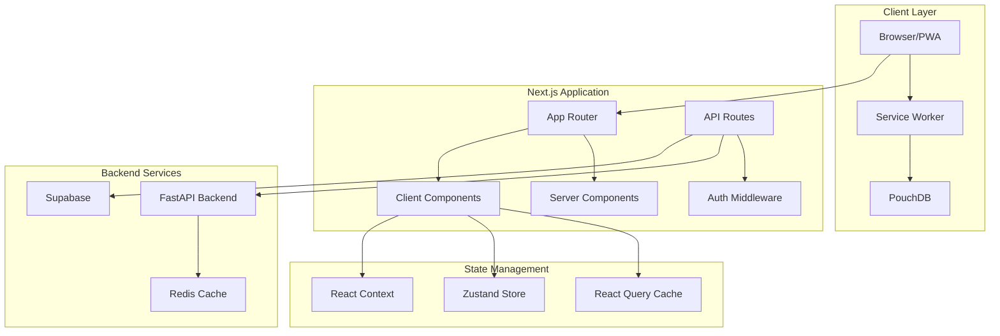
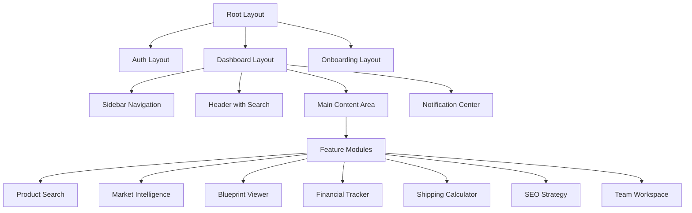

# Design Document: VentureOS UI

## Overview

VentureOS UI is a comprehensive frontend implementation for an AI-powered business intelligence and product sourcing platform targeting Bangladeshi resellers, importers, and SME owners. The interface provides bilingual support (Bengali/English), responsive design across devices, and seamless integration with 12 feature modules covering onboarding, product sourcing, market intelligence, business planning, financial tracking, and team collaboration.

### Design Goals

1. **Bilingual-First Architecture**: Native Bengali and English support with locale-aware formatting, not machine translation
2. **Responsive & Accessible**: Mobile-first design with WCAG 2.1 AA compliance and touch-optimized interactions
3. **Performance-Optimized**: Fast load times on 3G networks with progressive enhancement and offline capabilities
4. **Modular Component System**: Reusable UI components that scale across all 12 feature modules
5. **Real-Time Collaboration**: Live updates for team workspaces with conflict resolution
6. **Progressive Web App**: Offline-first architecture with service worker caching and background sync

### Technology Choices

- **Framework**: Next.js 14 with App Router for server-side rendering, streaming, and edge optimization
- **Styling**: Tailwind CSS for utility-first styling with custom Bengali typography configuration
- **State Management**: React Context + Zustand for global state, React Query for server state
- **Data Fetching**: React Query with optimistic updates and background refetching
- **Forms**: React Hook Form with Zod validation for type-safe form handling
- **Charts**: Recharts for data visualization with color-blind friendly palettes
- **Internationalization**: next-intl for message management with ICU MessageFormat
- **Authentication**: NextAuth.js integrated with Supabase Auth
- **Real-Time**: Supabase Realtime for collaborative features
- **Offline Support**: Workbox for service worker generation and PouchDB for local data persistence

## Architecture

### High-Level Architecture



### Application Structure

```
ventureos-ui/
├── app/                          # Next.js 14 App Router
│   ├── [locale]/                 # Internationalized routes
│   │   ├── (auth)/              # Auth layout group
│   │   │   ├── login/
│   │   │   └── signup/
│   │   ├── (dashboard)/         # Dashboard layout group
│   │   │   ├── dashboard/
│   │   │   ├── products/
│   │   │   ├── market-intelligence/
│   │   │   ├── blueprint/
│   │   │   ├── shipping/
│   │   │   ├── financial/
│   │   │   ├── seo/
│   │   │   ├── team/
│   │   │   └── settings/
│   │   └── onboarding/
│   ├── api/                     # API routes
│   │   ├── auth/
│   │   ├── products/
│   │   └── webhooks/
│   └── layout.tsx               # Root layout
├── components/                   # React components
│   ├── ui/                      # Base UI components
│   ├── features/                # Feature-specific components
│   ├── layouts/                 # Layout components
│   └── shared/                  # Shared components
├── lib/                         # Utilities and configurations
│   ├── api/                     # API client
│   ├── hooks/                   # Custom React hooks
│   ├── stores/                  # Zustand stores
│   ├── utils/                   # Utility functions
│   └── validations/             # Zod schemas
├── public/                      # Static assets
│   ├── locales/                 # Translation files
│   └── fonts/                   # Bengali fonts
└── styles/                      # Global styles
```

### Routing Strategy

**App Router with Internationalization**:
- All routes prefixed with locale: `/[locale]/dashboard`
- Automatic locale detection from Accept-Language header
- Locale persistence in cookies
- Middleware for locale validation and redirection

**Layout Groups**:
- `(auth)`: Minimal layout for login/signup
- `(dashboard)`: Full dashboard layout with sidebar navigation
- `(onboarding)`: Step-by-step onboarding flow layout

**Route Protection**:
- Middleware checks authentication status
- Redirects unauthenticated users to login
- Preserves intended destination for post-login redirect

### State Management Strategy

**Server State (React Query)**:
- Product search results
- Market intelligence data
- Financial tracker entries
- User profile and settings
- Team workspace data

**Client State (Zustand)**:
- UI state (sidebar open/closed, modals)
- Form draft state
- Notification queue
- Offline sync queue

**Context State**:
- Authentication context
- Locale/language context
- Theme context (future dark mode)

### Data Flow Patterns

**Optimistic Updates**:
```typescript
// Financial tracker entry creation
const mutation = useMutation({
  mutationFn: createEntry,
  onMutate: async (newEntry) => {
    await queryClient.cancelQueries(['entries'])
    const previous = queryClient.getQueryData(['entries'])
    queryClient.setQueryData(['entries'], (old) => [...old, newEntry])
    return { previous }
  },
  onError: (err, newEntry, context) => {
    queryClient.setQueryData(['entries'], context.previous)
  },
  onSettled: () => {
    queryClient.invalidateQueries(['entries'])
  }
})
```

**Real-Time Updates**:
```typescript
// Team workspace real-time subscription
useEffect(() => {
  const channel = supabase
    .channel('workspace')
    .on('postgres_changes', {
      event: '*',
      schema: 'public',
      table: 'workspace_data'
    }, (payload) => {
      queryClient.invalidateQueries(['workspace'])
    })
    .subscribe()
  
  return () => supabase.removeChannel(channel)
}, [])
```

**Offline Queue**:
```typescript
// Queue mutations when offline
const offlineQueue = useOfflineQueue()

const mutation = useMutation({
  mutationFn: async (data) => {
    if (!navigator.onLine) {
      offlineQueue.add({ type: 'CREATE_ENTRY', data })
      return { queued: true }
    }
    return api.createEntry(data)
  }
})
```

## Components and Interfaces

### Component Hierarchy



### Core UI Components

#### 1. Layout Components

**DashboardLayout**
```typescript
interface DashboardLayoutProps {
  children: React.ReactNode
  locale: 'bn' | 'en'
}

// Features:
// - Responsive sidebar (collapsible on mobile)
// - Global search bar (Cmd+K shortcut)
// - Language toggle
// - User profile dropdown
// - Notification bell with unread count
// - Breadcrumb navigation
```

**Sidebar Navigation**
```typescript
interface SidebarProps {
  isOpen: boolean
  onToggle: () => void
  currentPath: string
}

// Navigation items:
// - Dashboard (home icon)
// - Product Search (search icon)
// - Market Intelligence (trending icon)
// - Business Blueprint (document icon)
// - Shipping Calculator (truck icon)
// - Financial Tracker (chart icon)
// - SEO Strategy (megaphone icon)
// - Team Workspace (users icon)
// - Settings (gear icon)
```

#### 2. Form Components

**BilingualInput**
```typescript
interface BilingualInputProps {
  name: string
  label: { bn: string; en: string }
  placeholder?: { bn: string; en: string }
  type?: 'text' | 'number' | 'email' | 'tel'
  validation?: ZodSchema
  locale: 'bn' | 'en'
}

// Features:
// - Automatic Bengali/English keyboard detection
// - Locale-aware number formatting
// - Error messages in selected language
// - Touch-optimized for mobile (44x44px minimum)
```

**CurrencyInput**
```typescript
interface CurrencyInputProps {
  name: string
  label: string
  currency: 'BDT' | 'USD' | 'CNY'
  locale: 'bn' | 'en'
}

// Features:
// - Automatic ৳ symbol for BDT
// - Comma separators (Bangladesh locale)
// - Decimal precision (2 places)
// - Validation for positive numbers
```

#### 3. Data Display Components

**MarketplaceCard**
```typescript
interface MarketplaceCardProps {
  product: {
    id: string
    title: string
    titleTranslated?: string
    image: string
    priceRange: { min: number; max: number; currency: string }
    platform: 'alibaba' | 'pinduoduo' | 'xianyu' | 'dhgate' | 'aliexpress'
    qualityTier: 'cheap' | 'medium' | 'high'
    moq: number
    supplierRating: number
    leadTime: string
  }
  locale: 'bn' | 'en'
  onSelect: (id: string) => void
}

// Features:
// - Platform badge with logo
// - Quality tier indicator (color-coded)
// - Supplier rating stars
// - Profit margin calculator button
// - Add to comparison button
// - Lazy-loaded images with blur placeholder
```

**TrendAlert**
```typescript
interface TrendAlertProps {
  trend: {
    id: string
    productCategory: string
    trendStart: Date
    peakPeriod: string
    trajectory: 'rising' | 'stable' | 'declining'
    estimatedLifespan: string
    seasonalFlag?: string
  }
  locale: 'bn' | 'en'
  onDismiss: (id: string) => void
}

// Features:
// - Trajectory icon (arrow up/flat/down)
// - Time-based urgency indicator
// - Seasonal badge if applicable
// - "Learn More" action button
// - Dismissible with animation
```

**FinancialChart**
```typescript
interface FinancialChartProps {
  data: Array<{ date: string; value: number }>
  type: 'line' | 'bar' | 'pie'
  title: string
  timeRange: '7d' | '30d' | '90d' | '1y'
  onTimeRangeChange: (range: string) => void
  locale: 'bn' | 'en'
}

// Features:
// - Color-blind friendly palette
// - Responsive sizing
// - Interactive tooltips with exact values
// - Export to PNG/CSV
// - Loading skeleton during fetch
// - Empty state illustration
```

#### 4. Feature-Specific Components

**OnboardingWizard**
```typescript
interface OnboardingWizardProps {
  onComplete: (data: OnboardingData) => void
  locale: 'bn' | 'en'
}

interface OnboardingData {
  location: string
  productIdea: string
  businessType: string
  investment: number
  teamSize: number
  warehouseCapacity: number
  accountType: 'domestic' | 'international'
  internationalDetails?: {
    targetCountries: string[]
    currencies: string[]
  }
}

// Steps:
// 1. Welcome & language selection
// 2. Business type selection (Mode A/B)
// 3. Location & product idea
// 4. Investment & team details
// 5. Warehouse & account type
// 6. International details (conditional)
// 7. Summary & confirmation
```

**ProductSearchInterface**
```typescript
interface ProductSearchInterfaceProps {
  locale: 'bn' | 'en'
}

// Features:
// - Search input with autocomplete
// - Platform filter checkboxes
// - Price range slider
// - Quality tier filter
// - Shipping time filter
// - Sort options (price, rating, MOQ)
// - Grid/list view toggle
// - Infinite scroll pagination
// - Comparison mode (select up to 5)
```

**ShippingCalculator**
```typescript
interface ShippingCalculatorProps {
  locale: 'bn' | 'en'
}

interface ShippingFormData {
  weight: number
  dimensions: { length: number; width: number; height: number }
  destination: string
  productCategory: string
}

interface ShippingResult {
  agency: string
  cost: number
  leadTime: string
  method: 'air' | 'sea' | 'courier'
  customsDuty: number
  totalLandedCost: number
  riskFlags?: string[]
  seasonalWarnings?: string[]
}

// Features:
// - Form with weight/dimensions inputs
// - Destination dropdown (BD cities)
// - Product category selector
// - Results table with sorting
// - Cost comparison chart
// - Customs duty breakdown
// - Risk flag badges
// - Seasonal warning alerts
```

**BlueprintViewer**
```typescript
interface BlueprintViewerProps {
  blueprint: BusinessBlueprint
  locale: 'bn' | 'en'
}

interface BusinessBlueprint {
  businessModelCanvas: BMC
  financialProjections: FinancialProjection[]
  breakEvenAnalysis: BreakEven
  marketSizing: MarketSize
  goToMarketPlan: GTMPlan
  seoStrategy: SEOStrategy
  riskRegister: Risk[]
  teamStructure: TeamRecommendation
  confidenceScores: Record<string, number>
}

// Features:
// - Tabbed navigation for sections
// - Collapsible sections
// - Confidence score badges
// - PDF export button
// - Edit/regenerate options
// - Print-optimized layout
// - Scenario toggle (conservative/base/optimistic)
```

**FinancialTracker**
```typescript
interface FinancialTrackerProps {
  locale: 'bn' | 'en'
}

// Features:
// - Revenue/expense entry form
// - Time range selector (daily/weekly/monthly)
// - Revenue line chart
// - Expense breakdown pie chart
// - Product-level profit table
// - Best-seller ranking
// - Unsold stock alerts (>30 days)
// - VAT/NBR estimation display
// - Break-even progress bar
// - Export to CSV button
```

### Responsive Design Breakpoints

```typescript
const breakpoints = {
  mobile: '0px',      // < 768px
  tablet: '768px',    // 768px - 1023px
  desktop: '1024px',  // 1024px - 1279px
  wide: '1280px'      // >= 1280px
}

// Tailwind configuration:
module.exports = {
  theme: {
    screens: {
      'sm': '640px',
      'md': '768px',
      'lg': '1024px',
      'xl': '1280px',
      '2xl': '1536px',
    }
  }
}
```

**Mobile Viewport (<768px)**:
- Hamburger menu for navigation
- Single-column layouts
- Bottom navigation bar for key actions
- Touch targets minimum 44x44px
- Swipe gestures for cards
- Collapsible sections by default

**Desktop Viewport (>=768px)**:
- Persistent sidebar navigation
- Multi-column layouts
- Hover states for interactive elements
- Keyboard shortcuts enabled
- Expanded data tables
- Side-by-side comparisons

### Accessibility Implementation

**Keyboard Navigation**:
- Tab order follows visual hierarchy
- Skip to main content link
- Focus trap in modals
- Escape key closes overlays
- Arrow keys for list navigation

**Screen Reader Support**:
- Semantic HTML elements
- ARIA labels for icon buttons
- ARIA live regions for dynamic content
- Role attributes for custom components
- Alt text for all images

**Visual Accessibility**:
- Minimum 4.5:1 contrast for normal text
- Minimum 3:1 contrast for large text
- Focus indicators with 3:1 contrast
- Color-blind friendly chart palettes
- Text resizable to 200% without loss

**Form Accessibility**:
- Labels associated with inputs
- Error messages announced to screen readers
- Required fields marked with aria-required
- Validation errors linked with aria-describedby
- Fieldset and legend for grouped inputs

## Data Models

### Frontend Data Models

#### User Profile
```typescript
interface UserProfile {
  id: string
  email: string
  name: string
  phone?: string
  businessInfo: {
    name: string
    type: 'reseller' | 'importer' | 'sme' | 'manufacturer'
    location: string
    teamSize: number
    warehouseCapacity?: number
  }
  preferences: {
    locale: 'bn' | 'en'
    currency: 'BDT' | 'USD' | 'CNY'
    notifications: NotificationPreferences
  }
  subscription: {
    tier: 'free' | 'pro' | 'enterprise'
    status: 'active' | 'cancelled' | 'expired'
    currentPeriodEnd: Date
    usageQuota: {
      blueprintsGenerated: number
      blueprintsLimit: number
      apiCallsUsed: number
      apiCallsLimit: number
    }
  }
  onboardingCompleted: boolean
  userMode: 'mode_a' | 'mode_b' // reseller vs SME
  createdAt: Date
  updatedAt: Date
}
```

#### Product Search Result
```typescript
interface ProductSearchResult {
  id: string
  title: string
  titleTranslated?: string
  description: string
  descriptionTranslated?: string
  images: string[]
  platform: 'alibaba' | 'pinduoduo' | 'xianyu' | 'skybuybd' | 'dhgate' | 'aliexpress'
  priceRange: {
    min: number
    max: number
    currency: string
  }
  qualityTier: 'cheap' | 'medium' | 'high'
  moq: number // minimum order quantity
  supplierInfo: {
    name: string
    rating: number
    yearsActive: number
    responseRate: number
    reliabilityScore: number
  }
  leadTime: string
  shippingOptions: string[]
  priceHistory?: Array<{ date: Date; price: number }>
  category: string
  tags: string[]
  lastUpdated: Date
}
```

#### Market Trend
```typescript
interface MarketTrend {
  id: string
  productCategory: string
  trendName: string
  description: string
  geography: string[] // BD regions
  dataSources: string[]
  metrics: {
    searchVolume: number
    searchVolumeChange: number // percentage
    socialMentions: number
    adSpend: number
  }
  timeline: {
    startDate: Date
    peakPeriod: string
    currentTrajectory: 'rising' | 'stable' | 'declining'
    estimatedLifespan: string
  }
  seasonalFlag?: {
    season: 'eid' | 'winter' | 'school' | 'monsoon'
    peakMonths: string[]
  }
  demandHeatmap?: {
    region: string
    intensity: number
  }[]
  competitorCount: number
  marketMaturity: 'emerging' | 'growing' | 'mature' | 'saturated'
  confidenceScore: number
  createdAt: Date
}
```

#### Business Blueprint
```typescript
interface BusinessBlueprint {
  id: string
  userId: string
  productIdea: string
  businessType: string
  
  businessModelCanvas: {
    valueProposition: string
    customerSegments: string[]
    channels: string[]
    customerRelationships: string[]
    revenueStreams: RevenueStream[]
    keyResources: string[]
    keyActivities: string[]
    keyPartnerships: string[]
    costStructure: CostItem[]
  }
  
  financialProjections: {
    scenarios: {
      conservative: MonthlyProjection[]
      base: MonthlyProjection[]
      optimistic: MonthlyProjection[]
    }
    assumptions: string[]
    investmentBreakdown: InvestmentItem[]
  }
  
  breakEvenAnalysis: {
    fixedCosts: number
    variableCostPerUnit: number
    pricePerUnit: number
    breakEvenUnits: number
    breakEvenRevenue: number
    monthsToBreakEven: number
  }
  
  marketSizing: {
    tam: number // Total Addressable Market
    sam: number // Serviceable Addressable Market
    som: number // Serviceable Obtainable Market
    methodology: string
  }
  
  goToMarketPlan: {
    phases: GTMPhase[]
    channelPrioritization: Channel[]
    launchTimeline: string
  }
  
  seoStrategy: {
    googleSEO: {
      keywords: Keyword[]
      contentTopics: string[]
    }
    socialSEO: {
      platforms: SocialPlatform[]
      hashtags: Hashtag[]
      postingSchedule: string
    }
    marketplaceSEO: {
      platform: string
      titleTemplate: string
      descriptionTemplate: string
    }[]
    googleLensOptimization: {
      imageTagging: string[]
      altTextGuidance: string
    }
  }
  
  riskRegister: Risk[]
  
  teamStructure: {
    roles: TeamRole[]
    hiringPriority: string[]
  }
  
  confidenceScores: {
    overall: number
    financial: number
    market: number
    execution: number
  }
  
  generatedAt: Date
  version: number
}

interface MonthlyProjection {
  month: number
  revenue: number
  costs: number
  profit: number
  cashFlow: number
}

interface RevenueStream {
  name: string
  type: string
  projectedMonthly: number
}

interface CostItem {
  category: string
  amount: number
  frequency: 'one-time' | 'monthly' | 'annual'
}

interface InvestmentItem {
  category: string
  amount: number
  percentage: number
}

interface GTMPhase {
  phase: number
  name: string
  duration: string
  activities: string[]
  budget: number
}

interface Channel {
  name: string
  priority: number
  rationale: string
  estimatedCAC: number
}

interface Keyword {
  term: string
  searchVolume: number
  competition: 'low' | 'medium' | 'high'
  language: 'bn' | 'en'
}

interface SocialPlatform {
  name: string
  strategy: string
  postingFrequency: string
}

interface Hashtag {
  tag: string
  volume: number
  trendDuration: string
}

interface Risk {
  category: string
  description: string
  likelihood: 'low' | 'medium' | 'high'
  impact: 'low' | 'medium' | 'high'
  mitigation: string
}

interface TeamRole {
  title: string
  responsibilities: string[]
  requiredSkills: string[]
  estimatedSalary: number
}
```

#### Financial Entry
```typescript
interface FinancialEntry {
  id: string
  userId: string
  type: 'revenue' | 'expense'
  amount: number
  currency: 'BDT'
  category: string
  subcategory?: string
  description: string
  date: Date
  productId?: string
  invoiceNumber?: string
  paymentMethod?: string
  taxAmount?: number
  attachments?: string[]
  createdAt: Date
  updatedAt: Date
  syncStatus: 'synced' | 'pending' | 'failed'
}
```

#### Shipping Estimate
```typescript
interface ShippingEstimate {
  id: string
  agency: string
  method: 'air' | 'sea' | 'courier'
  cost: number
  currency: 'BDT'
  leadTime: {
    min: number
    max: number
    unit: 'days'
  }
  customsDuty: {
    amount: number
    rate: number
    hsCode?: string
  }
  additionalFees: {
    name: string
    amount: number
  }[]
  totalLandedCost: number
  riskFlags: {
    type: 'seizure' | 'delay' | 'damage'
    severity: 'low' | 'medium' | 'high'
    description: string
  }[]
  seasonalWarnings: {
    period: string
    impact: string
  }[]
  insuranceRecommended: boolean
  calculatedAt: Date
}
```

#### Notification
```typescript
interface Notification {
  id: string
  userId: string
  type: 'price_drop' | 'trend_alert' | 'reorder' | 'team_activity' | 'system'
  title: string
  message: string
  data?: Record<string, any>
  priority: 'low' | 'medium' | 'high'
  read: boolean
  actionUrl?: string
  actionLabel?: string
  createdAt: Date
  expiresAt?: Date
}
```

#### Team Workspace
```typescript
interface TeamWorkspace {
  id: string
  name: string
  ownerId: string
  members: TeamMember[]
  sharedDashboards: string[]
  settings: {
    allowGuestAccess: boolean
    dataRetentionDays: number
    notificationPreferences: Record<string, boolean>
  }
  createdAt: Date
  updatedAt: Date
}

interface TeamMember {
  userId: string
  role: 'owner' | 'co-founder' | 'manager' | 'analyst' | 'guest'
  permissions: {
    viewFinancials: boolean
    editFinancials: boolean
    viewBlueprints: boolean
    editBlueprints: boolean
    manageTeam: boolean
    exportData: boolean
  }
  joinedAt: Date
  lastActive: Date
}
```

### API Response Formats

**Standard Success Response**:
```typescript
interface APIResponse<T> {
  success: true
  data: T
  meta?: {
    page?: number
    pageSize?: number
    total?: number
    hasMore?: boolean
  }
  timestamp: string
}
```

**Standard Error Response**:
```typescript
interface APIError {
  success: false
  error: {
    code: string
    message: string
    details?: Record<string, any>
  }
  timestamp: string
}
```

### Local Storage Schema

**Offline Queue**:
```typescript
interface OfflineQueueItem {
  id: string
  type: string
  data: any
  timestamp: Date
  retryCount: number
  maxRetries: number
}
```

**User Preferences**:
```typescript
interface LocalPreferences {
  locale: 'bn' | 'en'
  theme: 'light' | 'dark'
  sidebarCollapsed: boolean
  recentSearches: string[]
  comparisonList: string[]
}
```

**Draft State**:
```typescript
interface DraftState {
  formId: string
  data: Record<string, any>
  lastSaved: Date
  expiresAt: Date
}
```

